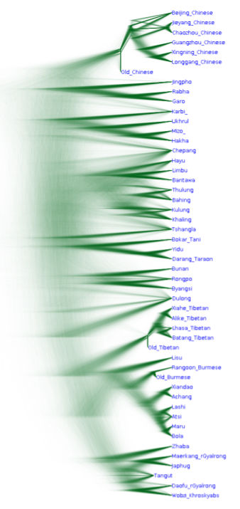

语言演化：词汇演化规律，历史比较方法和系统发育
======

# 概述

与物种和种群类似，随着时间推进，语言也存在缓慢但持续的演变。语言演化存在于语言的各个方面。语音、音系、词法、句法中都可以观察到缓慢、持续的有规律的演化。
词法、句法、词汇含义在持续演化的事实在有较长时间的文献记录，并未曾经历重大历史变故，从而其古代形式和现代形式可以称为一种语言的不同历史阶段的语言中尤其明显，包括英语、汉语白话、德语等(Campbell 2013)。
例如，就英语而言，KJV圣经译本（应注意，圣经翻译时的一大目的就是信徒可以自由阅读）和莎士比亚作品等著作反映的早期现代英语与今天的英语已经有了明显差异，虽然并非无法阅读 (Hamlin 2004)。早期现代英语中常见的thou代词今天已经完全被you取代，-st第三人称后缀简化成了-s，动词提升至句首表示强调的做法一度常见，但在现代英语中仅仅局限在少数几种情况(Bækken 2010)。
普通话被指定并获得标准语言地位的时间并不很长，但是已经能够观察到明显的语音变化。一个主要的倾向是女国音，即部分辅音发音部位前移、塞音向嘶音变动(胡明扬 1988, 霍唤民 2001)。语音学调查亦有发现新派普通话口音相比老派普通话已有值得记录的变化(Lee and Zee 2003)。

虽然各种文化中的流俗之见都常常将语言的演化当成语言劣化、污浊化、懒人化，语言标准化工作者也因为语言演化妨碍他们的工作而对此大加抨击，但这种观念是误导性的。语言演化首先是无法阻止的：例如，无论是汉语普通话还是当代英语(Labov et al. 2006, Trudgill 2002)都在有精准的录音设备和系统性初等教育的环境中出现了明显的语音变化。
语言演化也并非一种负面现象，既然它不会影响正常交流，并且还能够揭示人类语言能力的一些普遍性质(Campbell 2013)。

一门语言中出现这样或是那样的具体的某个演化，本身是完全随机的，但并非所有的语言演变都能够出现。我们可以大体上将语言演化分成词汇演化（包括语音和音系整体变化导致的词汇形式的变化，语言接触导致的词汇借入，类推导致的词汇变化，也涉及一些构词法）和语法演化（包括句法、词法的演化）历史语言学通过历史文献、比较当代现存的语言等方法，已经有了相对成熟的研究词汇或者说语音演化的方法。对语法的演化的研究相对而言更加困难，因为尚不存在一套能够精细地、不重复地衡量语法变化的语法描写范式，且考虑到所有可能的语法构成的空间是极为庞大的，我们必然需要对“可能的人类语言的语法”做出一定限制，从而必然面临一些诸如“人类语言是否有硬边界”、“语言机能是否有先天因素施加的硬边界”等理论上的争端(Crisma and Longobardi 2009)。
有一部分语言学家认为语法本质上是特殊的无语音实现的词汇，如所谓的functional heads，从而在这种假设下，对语法的研究本质上也是在研究词汇(Baker 2008)。这种理论仍然有很大争议(Newmeyer 2017)，且即使它是正确的，由于语法是通过这些虚词的彼此配合而涌现出的，对语法演化的研究显然也要比对单个的词汇的来源的研究或是对语言中特定环境中的某个音如何变化的研究要困难得多。
有鉴于此，如同大部分关于历史语言学的研究一样(Campbell 2013)，本文将注意力主要集中在词汇的演化上。使用生物中的比喻，我们将主要研究单个基因的演化，而不是各个基因如何配合，甚至转座子如何工作。（这个比喻无法抓住语言演化中的重要——甚至主要——因素，即由于语音变化，不同词汇中的同一个读音集体发生变化。生物的基因组中不存在这种机制。应注意不能将语言演化中的所有现象都和生物挂钩——正如19世纪的一些语言学家错误地认为的那样——虽然两者确实有很多相似之处(Van Driem 2008)。）

# 词汇演化的三大机制和历史比较方法

在语言演化中或许最为让人惊讶，但让历史语言学家感到非常幸运的一件事是，语音的演化往往有着非常简单、整齐无例外（即语言中处在特定语音环境中的音同时发生变化，而不只是特定几个词的某个音发生变化）、无记忆（即如果一种语言中的某个音X在该语言的更早阶段有两个不同的来源，但是如今已经看不出来了，那么来自两种来源的X音会发生统一的变化）、在语言中都能够观察到的音变规则。
这被称为**青年语法学派假设**，其名称来自19世纪德国的一个一度饱受抨击（“青年语法学派”如同“印象派”一样，原本是老学者们嘲讽他们靠不住而发明的说法，但是马上因为过于贴切被该学派拿来用作自称了），但是事后证明总体上正确，并且大大推动了印欧语研究的语言学学派。
本节将简单回顾(Campbell 2013)中介绍的青年语法学派提出的词汇演化的三大机制。

满足青年语法学派假设的那种规则、无例外的音变规则可以是有条件的或是无条件的。无条件的音变规则意味着一种语言中的某个音整体地变成另一个音，有条件的音变规则意味着一种语言中位于某个环境中的音整体地变成另一个音。这种“环境”可以是临近的音、词开头或是词尾部，在少数情况下也可以是其它语法环境（青年语法学派认为这是不可能的——“音变无视语法”——但是一些情况下音变会和词的形态学特征产生联系，从而确实受到语法调控(Hill 2014)）。
这样，一个音变规则可以一般地写成X > Y / A_B 的形式，表示“在音（或是词头、词尾等）A和B之间的X音变成了Y音”。
例如，在西班牙语中，发生了系统性的有条件p > b /V__V音变，即在西班牙的古代的通俗拉丁语中两个元音之间的p音，在现代西班牙语中系统性地变成了b音。
另一个西班牙语中出现的有条件音变规则是n > ŋ /__ #，即词尾的n音变成了鼻音。
无条件音变可以在英语的各个方言中找到典型的例子，如一些方言会将u音读得更加接近央元音，即发生了u > ʉ音变。

音变规则可以是音位性的或是非音位性的。音位性的音变会改变一种语言的音系，即它会改变这种语言中被认为是不同的的语音的格局。
大体上，音位性音变包括音位合并和音位分裂。例如，在梵语中出现过音位合并规则e, o, a > a。在原始印欧语中，“吃”是*ed-（星号表示这个词的形式是构拟出来的，并没有文献记录能够核实），而在梵语中就变成ad-了。我们可以想象，梵语的前身中可能也有另一个意思不同的ad-词，但是梵语中它和“吃”是没法区分的。
音位分裂和音位合并正好相反。很多时候，音位分裂是音位合并带来的：同一个音处在不同的语音环境中，从而经历了不同的条件性音位合并，等效的结果就是音位分裂。
这方面英语的*mouse*和*mice*是一个典型的例子。在原始日耳曼语中，“老鼠”一词的单复数是规则的，其中的元音是一样的：*mūs, *mūs-iz。日耳曼语中存在一个umlaut音变，即如果一个元音和它后面的一个舌位较前的元音只隔了一个辅音，那么这个元音的舌位可以在前，即使原本这个元音是后元音。
这样就发生了mūs-i > mȳsi的音变。之后，词尾元音脱落，mȳsi > mȳs音变发生。现在“老鼠”一词就变成了mūs, mȳs。最后，在英语在13世纪的元音大推移中，mūs, mȳs变成了今天的mouse和mice。于是我们就看到了一个ū > ʌʊ, aɪ的音位分裂。
非音位性的音变则不产生或者消灭任何音位，而只是简单地将一种语言中的一个音变成和这种语言中其它音并无关系的另一个音。它不改变语言的语音格局，因此相对而言不那么重要，但是仍然对分析语言谱系有帮助。
前述n > ŋ /__ #和u > ʉ都是非音位性的。

除了无例外音变，另一种重要的语言演化方式是**借词**。语言有接触就会出现借词。借词可以是出于实际需要的，如日语原本并没有“咖啡”一词，幕府末年开国后，借入了该词。借词也可以是“奢侈”的，即某个概念本来完全有本土说法，但是为了表示地位很高的一些概念，特意改用某种声誉良好的语言中的词，或者为了表示地位很低贱的一些概念，特意改用某种外来的声誉不良的词。在诺曼征服期间，法语相比英语是上流人的语言。因此，虽然英语中完全有*pigmeat*或是*swineflesh*之类的表示猪肉的词汇，但是既然“猪肉”是烹饪——在法国宫廷的精致生活中格外重要——的原料，源自法语的*pork* (< French *porc*)还是变成了最主流的说法。因为声誉不佳发生的借词要少见很多。例如，韩语中的外来语hɔstis来自英语hostess，指的是“在夜总会工作，主要接待男性顾客的女性”。

借词通常会经历一些修改来适合借入语言的音系和词法，但不会完全变得和原生词汇毫无差异。这些特性可以用于辨认一种语言中的借词。
如果我们注意到两种语言中有词汇看起来是同源的，那么它们可能意味着这两种语言是同一种语言分化而来的，也可能意味着其中一种语言从另一种语言借入了词。
如果一个词不满足它所在的语言中大量其它的词都满足的某种语音定律（比如说特定的读音从来不出现在词的开头），那么这个词很可能借词。
语音历史也可以用于鉴别借词：如果我们知道语言X和语言Y有过接触且有共享词，如果语言X中的这个词历史上能够验证出现了规律的音变，而语言Y中的这个词不能，那么很可能这个词是Y语言从X语言借过去的。
如果两种语言中看起来同源的词在一种语言X中是规律地通过构词法构建而来的，而在另一种语言Y中似乎没有明显的构词方式，那么很可能这个词是X语言从Y语言借过去的。例如，英语中的algebra构词方式不明，但是它和阿拉伯语中的al jabr类似而意义连贯，而阿拉伯语中al为冠词，jabr表示“重新p拼合，al jabr表示“（通过代数方法）把缺失的东西（即未知变量）找回来”，因此我们可以确定英语是从阿拉伯语借入了这个词。（当然，就这个特定的情况而言，充足的文献证据已然证明algebra一词的历史了）
表示陌生概念的词（如英语中关于非洲动物的词）当然也很可能是借词。

最后一种重要的机制是**类推**。如果一个演化现象没有很好的无例外音变或是借词的解释，那么它很可能来自类推。英语的speak的不规则过去式spoke很可能是从break - broke不规则过去式类推而来的：早期现代英语中过去式是spake而不是spoke。类推可能会干扰对规则音变和借词的分析。例如，类推可能会让动词的不同形式的词尾趋同，从而抹去词尾音变提供的信息。类推还可能将一些另有来源的词重新分析成好像是在本语言内使用构词法正常构造出的，从而遮盖借词来源。一个典型的例子是英语的crayfish（小龙虾）。它来自法语的crevice，但是因为是水产品，被和fish（如shellfish）联系了起来，从而因为类推而讹为crayfish。如果我们只是看着表面上规整的cray-fish构词，就会错误地认为它不是借词。

音变无例外、借词、类推——这就是青年语法学派给出的词汇的演化方式。今天的历史语言学仍然是按照这个研究范式运作的。
如果我们假定历史上的语言也是通过这些机制发生演化，并分裂成如今的种种语言的，那么实际上我们可以通过比较现今的语言（当然也包括历史上的文献记录）来重构语言在历史上的演化，并探索哪些语言可能是从同一种（现已消失的）祖先语言分化而来的，甚至可以探索这种祖语的样貌。
大体的步骤是这样的：首先从待比较分析的语言中寻找同源词，即语音形式看起来有关，并且意义有关的词，这一步需要小心地排除借词，并且不要把类推发生之后的词的形式直接当成无例外音变导致的。（不过借词并非无用：由于一个词在源语言中可能已经发生了音变，而在借入的语言中没有发生音变或者只是发生了部分音变，通过借词能够恢复出源语言的早期形式。如日语中的汉语词能够反映不同时期的汉语(Endo 2015)。）
找到同源词之后，需要列出不同语言的同源词的各个音的对应，并尝试（根据既往已知的语音变化）写出音变规则，构拟出原始音。
随后，应该分析猜测出的音变规则在待研究的几门语言的其它地方是否能解释一些现象。如果可以，那么还需要进一步分析构拟出的原始语言的语音格局是否合理，是否符合已知的类型学规律等。如果所有事情都符合得很好，那么我们就得到了祖语的构拟形式，以及祖语如何演化出待研究的各语言的演化树。

# 历史语言学中的系统发育树

语言的演化相比生物体基因的演化要复杂很多，在很多方面需要更多的人工分析以保证结果可靠。通过计算机模拟决定生物之间的亲缘关系是相对可靠的，因为不同生物的基因组上都有彼此同源，本身不具有特别明显的功能（从而不经历明显的自然选择）的基因，这些基因的突变速率是容易估计的，从而使用它们能够比较准确地知道不同生物之间的亲缘关系(Reich 2018)。
通过统计方法，人们能够构建系统发育树或者系统发育网来呈现这些关系(Yang 2006)。
然而，在历史语言学中不加思考地简单使用这一方法将会带来无法接受的误差，主要原因是借词和伪同源词的频繁出现。
如前所述，历史比较方法能够辨认出部分借词和伪同源词，但这种辨认至少目前还无法自动进行。

然而，历史语言学中，人工分析本身也可能因为历史上的语言学家的轻率判断造成的思维定势、研究者本人对某些语言的关系有先入为主的判断等原因而存在偏差。
此外，同源词和借词的问题能够使用对要研究的语言做预分析，使用借词较少的词汇列表构建系统发育树来解决。用于构建系统发育树的统计方法也能够对同源词和借词的问题有一定的提示，因为只要借入和借出语言均在树中，如果有大量借词出现，那么统计分析将不能够得到一个清晰的树结构。

目前的系统发育方法需要语言学家手动标注不同语言中同源词的哪些音是彼此对应的。考虑到历史比较方法目前无法自动化，这也是应当的。
在使用工具（如EDICTOR (List 2021)；一个这种将同源词中的同源音标注，将不同语言转化为某种“基因组”的例子可在其网站上找到）将同源词中的同源音关联起来之后，构建语言的系统发育树就转化为了一个典型的演化生物学中的系统发育问题，可以使用标准的贝叶斯谱系分析方法解决：根据既往知识，设定不同音变发生的概率（先验概率），据此建立一个随机产生并修改演化树的马尔可夫过程，最终抽样出概率较大的若干演化树之后，输出这些树的某种“共识”(Bryant 2003, Yang 2006)。
观察不同的高概率树的不同之处（通常将所有树绘制在一张图上以体现这一点，称为densitree），我们可以发现哪些地方可能存在同源词或是同源音位标记错误、借词没有剔除等问题。下图是一个典型的densitree，来自(Sagart et al. 2019)，补充材料中4.8节

可以看到，总的来说我们仍然能够看出一个树结构，这体现了历史语言学中假定语言演化可以使用演化树表示是合理的。另一方面，我们也看到，部分语言（或语支）在不同的树中显然是被归到了不同的祖语的后代中，这表明这些语言的同源词辨认、借词辨认等存在很大问题。

系统发育方法已经被广泛用于印欧语系(Gray & Atkinson 2003, Garrett 2018, Goldstein 2020)和汉藏语系(Sagart et al. 2019, Zhang et al. 2019)。例如，系统发育方法在无其它历史语言学知识输入的情况下，给出的对文献资料较多、研究较透彻的日耳曼语族和罗曼语族的分类大体上与传统的手工分类的结果是一致的，从而证实了前述研究范式的可靠性，并可用于定位不同语言分化的时间，从而为分子人类学和考古学纪年提供佐证。

应注意，正如完全手动的历史语言学研究不能不加思考（排除借词、类推等）地机械进行，系统发育方法也是不能机械进行的。
一个典型的例子是，(Gray & Atkinson 2003)中通过系统发育方法计算认为印欧语系应当起源于安纳托利亚，但是这一说法和语言学和分子人类学基于其它证据得到的理论相悖，且存在方法论问题 (Garrett 2018)。

# 结论

本文讨论了语言的各个部分的演化的客观存在以及它和生物演化，语音演化的三大机制：无例外的音变、借词和类推，讨论了这些机制的互相影响，介绍了根据这些机制实施历史比较、人工分析语言演化树的方法，最后介绍了在人工标注同源词之后，使用遗传学中的系统发育方法自动获得演化树的方法。

# 参考文献

Bækken, Bjørg. (2010). Inversion in Early Modern English. English Studies. October 2000. 393-421. 10.1076/0013-838X(200009)81:5;1-8:FT393. 

Baker, M. C. (2008). The macroparameter in a microparametric world.

Bryant, D. (2003). A classification of consensus methods for phylogenetics. DIMACS series in discrete mathematics and theoretical computer science, 61, 163-184.

Garrett, A. (2018). New Perspectives on Indo-European Phylogeny and Chronology 1.

Goldstein, D. (2020). Indo-European phylogenetics with R, Indo-European Linguistics, 8(1), 110-180. doi:

Gray, Russell & Atkinson, Quentin. (2003). Language-Tree Divergence Times Support the Anatolian Theory of Indo-European Origin. Nature. 426. 435-9. 10.1038/nature02029. 

Hamlin, Hannibal. Psalm culture and early modern English literature. Cambridge University Press, 2004.

Hill, Nathan W. (2014) 'Grammatically conditioned sound change.' Language and Linguistics Compass, 8 (6). pp. 211-229.

Historical Linguistics: An Introduction. Front Cover. Lyle Campbell. Edinburgh University Press, 2013.

胡明扬. "北京话"女国音"调查(1987)." 语文建设 1(1988):6.

霍唤民. “女国音"不是标准音[J]. 北京广播电视大学学报, 2001.

Labov, William; Ash, Sharon; Boberg, Charles (2006), The Atlas of North American English, Berlin: Mouton-de Gruyter, ISBN 3-11-016746-8

Language Contact between Chinese and Japanese: Peculiarity of Japanese in the Manner of Accepting Chinese. Endo, Mitsuaki. The Oxford Handbook of Chinese Linguistics. Edited by William S-Y. Wang and Chaofen Sun Print Publication Date: Apr 2015

Laurent Sagart, Guillaume Jacques, Yunfan Lai,  View ORCID ProfileRobin J. Ryder, Valentin Thouzeau, Simon J. Greenhill, and Johann-Mattis List. PNAS May 21, 2019 116 (21) 10317-10322.

Lee, W., & Zee, E. (2003). Standard Chinese (Beijing). Journal of the International Phonetic Association, 33(1), 109-112. doi:10.1017/S0025100303001208

List, Johann-Mattis (2021): EDICTOR. A web-based interactive tool for creating and editing etymological datasets. Version 2.0.0. Max Planck Institute for Evolutionary Anthropology: Leipzig.

Van Driem, G. (2008). THE LANGUAGE ORGANISM: PARASITE OR MUTUALIST? Studies in Slavic and General Linguistics, 33, 101–112.

Newmeyer, Frederick J. Chapter 25 Where , if anywhere , are parameters ? A critical historical overview of parametric theory. in On looking into words (and beyond): Structures, Relations, Analyses (2017).

Paola Crisma, Giuseppe Longobardi - Historical Syntax and Linguistic Theory-Oxford University Press, USA (2009)

Reich, David. Who we are and how we got here: Ancient DNA and the new science of the human past. Oxford University Press, 2018.

Trudgill, Peter (2002), The Dialects of England, Oxford: Blackwell

Yang, Ziheng. Computational molecular evolution. Vol. 284. Oxford: Oxford University Press, 2006.

Zhang, M., Yan, S., Pan, W. et al. Phylogenetic evidence for Sino-Tibetan origin in northern China in the Late Neolithic. Nature 569, 112–115 (2019). https://doi.org/10.1038/s41586-019-1153-z

<!-- Beckwith, Christopher I. Koguryǒ: The Language of Japan's Continental Relatives: An Introduction to the Historical-Comparative Study of the Japanese-Koguryoic Languages, with a Preliminary Description of Archaic Northeastern Middle Chinese. Leiden: Brill Academic Publishers. 2004. -->