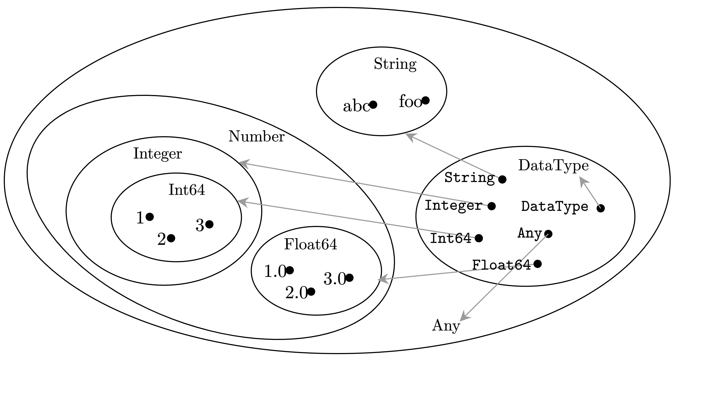

The type system of Julia
========

# Preliminaries

## Dynamic, strong typing

Julia is strongly typed in that all values in Julia have a **concrete type**.
Type checking in Julia happens at runtime and therefore the language is dynamically typed.
Dynamical type checking happens in two places:
1. Function dispatch. That's to say, if a function invocation does not match an existing function definition, then a type error is thrown.
2. Variable type declaration. `x::Int` means any assignment to `x` involves a type conversion, and if this is not possible, a type error is thrown.

There are still a lot of "static typing" mechanisms in Julia,
in the sense that certain constructs feel more declarative and their behaviors can be described by a type system calculus ($\Gamma \vdash A <: B$ style).
This includes declaration of composite types and subtype relations.

In Lean's type theory (or the type theory of many other dependent type provers), the primitives are only [the type universes, dependent arrow types, and inductive types](https://lean-lang.org/theorem_proving_in_lean4/Inductive-Types/#inductive-types).
Now if we compare the three pillars with Julia or more generally industrial languages,
- We don't have type universes in Julia or in most programming languages. (This can be utilized for better expressiveness, as in System F, but more often it's just for convenience.)
- Arrow types, i.e. function definitions and invocation, correspond to what Julia community calls method dispatch. The two are different, though a connection can be found [here](#encoding-a---b).
- The "static" mechanisms in industrial languages are [a rather imperfect shadow of general inductive types](plt概况.md#结构体和枚举).

Mechanisms to attach a tag i.e. a descriptor to a value seem to never be dynamic even in dynamic programming languages
(in Julia, for instance, a struct is a constant).
Mechanisms to declare what type tags are legitimate in the language therefore should be static too.

## Statically capturing the behaviors of a dynamically typed language

One may wonder whether we can have a static type system that gives all and only terms in Julia that do not produce type errors.
Such a system of course trivially exists but the nontrivial problem is whether it is decidable or consistent or can be formulated with concepts already defined in standard Julia.

Of course, the existing "static" typing mechanisms, namely definition of composite data types, have to be incorporated directly into that static type system.

Below, when we talk about "Julia's type system without qualification,
we're talking about the part of Julia related to definition of composite types, subtypes, etc.

## Models of the type system

We may also wonder the *semantics* or *model* of the type system.

Several types of models are available when interpreting type systems.
A **set theoretic** model typically means a model in which types are interpreted as sets *and functions are interpreted as set theoretic functions*.
Such a model does not always exist, as in the case of System F, because of impredicativity:
being able to unrestrictedly quantify over all types enables one to create a type corresponding to a proper class.
Julia has impredicativity in its `UnionAll` construct; but before that, it has `Type::Type`,
These two make it unlikely to have a true set theoretic interpretation of the type system of Julia without some tweaking.

Another issue related to set theoretic semantics is the halting problem.
Total computable functions can be interpreted as mathematical functions;
studying non-halting function is complicated,
and typically involves something like domain theory if we want good algebraic properties.

The models listed above are *extensional* models in that functions are modeled as their input-output behaviors.
We also have *intensional* models, in which a function is... just its source code.
Two functions with the same input-output behaviors are still different if their internal algorithms are different.
We note that extensional models seem conceptually simpler (as no additional information about implementation is attached to functions),
but can involve rather complex mathematical objects that in practice never appear in everyday programming.
($\natnums \to \natnums$ has the same cardinality of $\reals$, for instance.)

On the other hand, intensional models are conceptually more complex, but typically everything in an intensional model is countable.
It is in theory also possible to study intensional models in which types are regarded as uncountable sets or, without Axiom of Choice, infinite but are not comparable to cardinality of $\natnums$ or $\reals$.
But it makes no sense as these terms are not constructable.
That's why intensional models are closer to what actually happens in computers (provided that the memory is always large enough).

We note that partial computable functions can be studied in intensional models too.

A freely available intensional model for an arbitrary typed lambda calculus is the term model,
in which a type is understood as a set of terms modulo some equivalence
(so a type contains *values* and not expressions),
and $A \to B$ is understood as terms that behave like functions.
Application is syntactic substitution.

# Basic data and types in Julia

## The tree of data types

Concrete types are defined either via `struct` or via `primitive type`.
They can be declared to belong to different abstract types,
thus forming a tree of types connected by subtype relation `<:`.
At the top of the tree sits `Any`.

```julia
function show_supertypes(T)
    while T != Any
        println(T)
        T = supertype(T)
    end
    println(Any)
end

show_supertypes(Int)
# Output:
# Int64
# Signed
# Integer
# Real
# Number
# Any
```

And `12::Number`, `12::Any`, etc.
From this perspective one may want to naively interpret `::` as $\in$, and `<:` as $\subseteq$.
The main problem of this interpretation is `Any::Any`, and this screams Russell's paradox.

The way we adopt to resolve this problem is to assume that a type name means two things:
in `Any::Any`, the first `Any` is understood as a *type tag*, which is nothing but a name (a string, in the metalanguage),
while the second `Any` is interpreted as the set that the name `Any` refers to.
We'll go back to this topic when talking about [the type of a type](#types-of-types).

On the other hand, `A <: B` should be understood as "the set denoted by `A` is a subset of the set denoted by `B`".
That's to say, `A` and `B` should both be understood as the set they refer to and not just the names of the types.


## Types of types

All types defined in the tree of data types have the type `DataType`, whose type is itself.

```julia
typeof.([Integer, Any, FunctionArrow{Int, String}, DataType,])
# Output:
# 4-element Vector{DataType}:
#  DataType
#  DataType
#  DataType
#  DataType
```

However,

```
julia> Union{Int, Float64} :: DataType
ERROR: TypeError: in typeassert, expected DataType, got Type{Union{Float64, Int64}}
```

This means in the set denoted by `DataType`, we can only find concrete type tags, like `Int` or `Float64`, but not unions.
Because `DataType` is a concrete type tag, `DataType :: DataType` (that's to say, the tag `DataType` belongs to the set denoted by itself).

A user defined struct in Julia behaves in a way comparable to types shipped with Julia - primitive or composite.

```julia
struct A end
A::DataType
A()::A
A <: Any
```

That's to say, the tag `A` is in the set denoted by `DataType`,
and the set denoted by `A` is a subset of the set denoted by `Any`.

Thus the situation is illustrated below.
Here dots being in a circle means $\in$, and a circle being in another means $\subseteq$.
Hence `1::Number`, `Float64::DataType`, `Any::DataType`, and so on.
Note that the `1` value in the set denoted by `Int64` has the tag `Int64` on it, and so on.



But the problem of an overly large set doesn't automatically go away.
For instance we may ask how large is the set denoted by `DataType`.
Whatever its internal structure is, by virtue of being a set of type descriptors,
it should be countable or at least is a properly defined set.
We say "a properly defined set", because if we naively assume that the universe containing all concrete and abstract types is the ZFC set theoretic universe - `Type 0` in Lean - or at least has the same cardinality
(which is not an unreasonable expectation, as we can imagine we interface Julia with an oracle machine dealing with arbitrarily complex math objects),
then the set denoted by `DataType`, being "the collection of all types", isn't a set at all and has no cardinality.

Therefore, in order to accommodate `DataType::DataType`, 
we have to assume dual status of types (as type tags, and as sets),
and the existence of a type containing all type tags in turn means
we have to 
- either give up the bidirectional relation between type tags in the set denoted by `DataType` and nodes in the tree of data types
(hence there are "ghost" types with only set interpretations, but no type tag), or 
- assume that each data type has a type tag but the number of data types is limited and the set of all sets denoted by a type is a well defined set.

These constraints are still quite mild:
we haven't ruled out the possibility that the cardinality of `DataType` is the same as $\reals$.
But we'll soon realize that the interaction between type tags and other parts of the language will impose more size constraints.

## Tuples

A tuple in Julia is almost a tuple in untyped set theory.

```julia
Tuple{Int} <: Tuple{Integer} # true
```

Unlike the case of tuples, we have 
```julia
!(Vector{Int} <: Vector{Integer})
```
This means parameterized structs are nominal. 

It is also how we capture variable number of arguments.

```julia
f(x...) = x
typeof(f(1, 2, 3)) # Tuple{Int64, Int64, Int64}
```

Julia offers some primitives to define flexible tuple types.
For instance,
```julia
NTuple{2, Int} == Tuple{Int, Int}
```
Note that `Tuple{Int, Tuple{Float64, Float64}}` is not the same as `Tuple{Int, Float64, Float64}`.
We seems to be unable to define a flat tuple with $n$ `Int` elements and $m$ `Float64` elements.
But this isn't necessarily a bad thing, as it would be hard to operate on such a tuple.

`NTuple` can be seen as a counterpart of `Fin n -> a` in Lean.
Julia's parameterized types  give us almost no way to manipulate the structure of a type according to unknown values,
and therefore we have to reply on primitives like `NTuple` supplied by the compiler to have limited dependent type features.

## `Type`

Besides `DataType`, we also have `Type`.
We have `DataType <: Type`, and this also means `DataType :: Type`,
as the tag `DataType` is in the set denoted by `DataType`
and hence has to be in the set denoted by `Type`.

The set denoted by `Type` contains three subsets: the set denoted by `DataType`, the set denoted by `Union`, and the set denoted by `UnionAll`.
The three types - as tags - are all elements of the set denoted by `DataType`,
as `Union::DataType` and `UnionAll::DataType`.

We have 
```julia
Union{Int, Int} == Int
Union{Union{Int, Float64}, Int} == Union{Float64, Int}
```
and therefore union types in Julia have clear set theoretic semantics.

The meaning of `UnionAll` is to be discussed in TODO.
Also, note that the set denoted by `Type` does not include functions.

# Functions

## Functions are singletons

It's not straightforward to refer to a function with an arrow type like $f: A \to B$ (called a **method** in Julia terminology) directly in Julia,
as in Julia, a **function** contains several methods, and which method is called when a function invocation happens is decided by multiple dispatch.
One may want to define the type of this function as the intersection of the arrow types of its methods (intersection and not union: the set theoretic interpretation of $A \to B$ here is the set of functions that have definition for all elements in $A$ and $f(A) \subseteq B$),
but this is unwieldy as a typical Julia function has quite a lot of methods;
a more thorough discussion on the issue can be found in Abstraction in Technical Computing, Sec. 4.6.

Alternatively, a function (in Julia terminology) is regarded as a *name*, and hence should be regarded as a singleton.

```julia
typeof(sum) # typeof(sum) (singleton type of function sum, subtype of Function)
show_supertypes(typeof(sum))
# Output:
# typeof(sum)
# Function
# Any
```

Each function name belongs to the set denoted by the singleton type containing it,
and the set denoted by the singleton type is a subset of the set denoted by `Function`.

Conversely a method can be attached to anything - including an existing singleton.

```julia
(::Nothing)(x) = x
nothing(1) # 1
```

Because of the lack of arrow types, type checking of function calls has to be captured by adding a so-called method table in type judgments.
The paper A Type System for Julia by Chung, Benjamin, Northeastern University, for instance,
uses a method table in his type system calculus,
effectively eliminating the need for arrow types (Sec. 4.3).

## Encoding `A -> B`

It is still possible to simulate arrow types in Julia,
from the perspective of operational semantics:
that's to say, whenever the input type is not a given type, a type error is raised.
This can be done by the following construct:

```julia
struct FunctionArrow{A, B} 
    run::Function
end

function (f::FunctionArrow{A, B})(x::A) where {A, B}
    return f.run(x)::B
end

# A function with multiple methods
function foo(x::Int)
    x + 1
end

function foo(x::String)
    x
end

foo(5) # 6 
foo("str") # "str"

foo_packaged = FunctionArrow{Int, Int}(foo)
foo_packaged(5) # 6
foo_packaged("std") # MethodError
```

`foo_packaged` obligatorily calls the `Int -> Int` method of `foo`,
and if this is not possible, raises a method error.
That's to say, if `f::FunctionArrow{A, B}` and `x::A`, then `f(x)` causes no method error, if and only if 
- There exists a `A -> B` method of the function `f.run` in the method table, and 
- That method causes no method error in its internal code.

Recursively, a no-type-error proof based on this theorem is isomorphic to a standard proof of well-typedness in typed lambda calculi.
This means if in a Julia program,
functions are always defined using `FunctionArrow` (perhaps with some macros to automatically extract the type information of a `function` block
and pass it to a corresponding `FunctionArrow` constructor),
then type safety can be guaranteed by static check resembling static check of more "canonical" type systems with arrow types. 

In simply typed lambda calculus, all we need is the arrow type,
and composite data types can be encoded into arrow types.
In Julia we start with composite data types and method dispatch
and end up getting something similar to arrow type.

## Dependent arrow not definable

Some sort of dependent type-like feature exists in Julia.
For instance consider the following code snippet:

```julia
using StaticArrays

function foo(n::Int)::SVector{n, Int64}
    SVector{n, Int64}(zeros(n))
end

foo(2)
# Output:
# 2-element SVector{2, Int64} with indices SOneTo(2):
#  0
#  0
```

The type of this method is `(n:Int):SVector{n, Int64}`, but this type can't be captured by `FunctionArrow` defined above.
Obviously, we made a mistake in implementing `foo`
and sometimes the return value is `SVector{n+1, Int64}`,
then we get a type error.
However, the following definition
```julia
struct DependentArrowExample
    dim::Int
    data::Array{Int, dim}
end
```
fails, because `ERROR: UndefVarError: ``dim`` not defined`.
Therefore Julia lacks the ability to express dependent arrow types with its native type notation,
but it needs to.
Hence a sound type system of Julia involves concepts beyond what Julia's existing type system provides.

## Size issue of interpretation of `A -> B`

With given `A` and `B`,
interpretation of `FunctionArrow{A, B}` can be done in two ways - or three ways.
The first two are aforementioned:
type tags and sets represented by type tags.
The third is real arrow type (containing all terms that are guaranteed to cause no type error), which itself should be interpreted.

The issue is further complicated because of existence of `Function`,
a topic we're going to touch in the next section.

## Interpretations of `Function` as set of all functions

In Julia "functions" are singletons and "methods" are not directly accessible.
The the set denoted by `Function` can be literally interpreted as the set of *names* of functions,
and is hence trivially countable.

We may consider some alternatives.
First, let's consider what happens if we have a `Function` type directly covering all methods, and not just singletons with methods attached to it.
In this section we revert to the usual terminology and call a Julia method simply a function.

In the first attempt,
suppose the set denoted by `Function` contains functions in an extensional sense.
We further let it contain functions that are not necessarily computable.

The total number of functions from natural numbers to natural numbers is the same cardinality as the real numbers $\reals$.
This cardinality bump means as long as we allow `Function` to contain all functions from a countable type to itself, there can't be a set theoretic interpretation of `Function`.
This is because we're able to define functions from `Function` to `Function`,
and the number of functions is now $\reals^\reals$...
This gives us the following process (where $A$ is countable):
$$
A \\
A \cup A^A \\
A \cup A^A \cup (A \cup A^A)^{(A \cup A^A)} \\
\dots
$$
`Function`, if containing all functions, should be lower bounded by the limit of $A_{n+1} = A_n \cup A_n^{A_n}$.
But obviously, because the cardinality of $A_n^{A_n}$ is always strictly larger than the cardinality of $A_n$, no such fixed point exists.

In the second attempt, we keep the extensional idea but limit the functions to total computable functions.

Because halting is a rather hard problem (note that "a function halts at every point is $\Pi_2$-complete"),
the set of total computable function is not enumerable and is not decidable.
However it *is* closed under composition, the usual arithmetic functions, etc.
and therefore forms a good algebraic structure.
We can also repeat the iteration above: $A_{n+1} = A_n \cup \text{the set of total computable functions from An to An}$.
Because the set of total computable function is known to be countable,
this process has to stabilize finally, resulting in a subset of total computable functions.

So is this viable?

It technically may be with some tweaking. The main issue is,
if total computable functions from $A$ to $B$ are interpreted extensionally, 
then one may ask what it means for a function from the set of $A$-to-$B$ functions to $C$ to be computable:
computable functions take what can be encoded as natural numbers as inputs,
not an infinite set of input-output pairs.
Thus the former function should be passed in as a code (which can later be evaluated).
This sounds rather strange for an extensional model (on the other hand, higher order functions are much more naturally captured in naive set theoretic semantics, as $A \to B$ is just another set, and $(A \to B) \to C$ is naturally defined).
Basically, this means in our model, when a function is passed into a higher order function, *a* version of its implementation is passed with the source code visible to the higher order function, but what implementation is passed is pretty much random.

In practical developments, either we only call a function passed in, 
or we have comprehensive reflection and is able to look into its structure.
The second style is inherently intensional.
The first style makes no use of the encoding of the function passed in.
So this model captures none of the two uses.

(We also note that this is an illustration of the distinction between extensional and intensional semantics.
Programming without function-level reflection admits an extensional semantics,
but for naturalness the semantics is inevitably large,
because to avoid treating functions passed to higher order functions as natural numbers, they are most naturally regarded as set theoretic functions,
and the size of things soon gets out of control.
Programming with function-level reflection has to have an intensional semantics.)

Therefore, for any language with a `Function` type containing all functions, no natural extensional semantics is available.
The only sensible interpretation is to view the set denoted by `Function` as the set containing the source code of all total computable functions.

## `Function` as set of names

TODO: not sure if this is going to give us a size problem.

## Multiple dispatch

Method dispatch can be taken as the foundation of how typed expressions are used in computation,
and [to prevent method not found errors](plt概况.md#编程语言动态类型检查) is the main motivation for us to have a static type system.
On the other hand, method dispatch can also be understood in a static type system
(though some runtime infrastructure is necessary to fully support *dynamic* method dispatch).

Ad hoc polymorphism is easily captured by type classes.
Polymorphism related to subtypes can be divided into two parts.
The first part corresponds to what is called 
[inheritance of methods in ordinary OOP language](plt概况.md#基于数据类型转换的方法继承),
in which a function call may be dispatched to a method defined on abstract or union types.
The second part corresponds to what is called subtype polymorphism,
in which we can assign a value of a certain type to a variable with its super type 
[*without* converting the type tag of the value](plt概况.md#在未知对象具体类型时的动态方法派发),
and when a method is called on the variable, method dispatch works according to the type of the value and not the declared type of the variable.

Because in Julia it's not possible to extend a concrete type,
using type classes to simulate its method dispatch behavior is actually easier.
That said, like other kinds of subtype polymorphism, simulating it using type classes strongly depends on the details of type class instance resolution.
The following intuitive simulation for instance doesn't work in Lean,
because in Lean coercions aren't a part of type class instance searching:

```Lean
-- Requirements of being a subtype of Abstract; none in Julia
class Abstract (α : Type)
-- An abstract type, to which concrete types can be associated to.
-- This is to make sure expressions like v::AbstractType = 6 do not erase the concrete type information of the value on the RHS.
-- Can also be understood as dyn trait in Rust.
structure AbstractType where 
  α : Type
  inst : Abstract α
  val : α

-- Nat and String are concrete types.
-- Because in Julia concrete types can't be extended,
-- there's no need for declaration of "Nat type class" or "abstract Nat class" 
-- to contain contents of subclasses of Nat.

-- Subtype declaration, so a Nat term can be safely placed in AbstractType
instance : Abstract Nat where 
-- Should be handled by macro
@[coe] def nat_to_abstract_type (x : Nat) : AbstractType := ⟨Nat, inferInstance, x⟩ 

-- Subtype declaration, so a String term can be safely placed in AbstractType
instance : Abstract String where
-- Should be handled by macro
@[coe] def str_to_abstract_type (x : String) : AbstractType := ⟨String, inferInstance, x⟩

universe u
class MyAdd (α : Type u) (β : Type u) where
  add : α → β → AbstractType

instance : MyAdd Nat Nat where
  add (x : Nat) (y : Nat) := ⟨Nat, inferInstance, x + y⟩

instance : MyAdd String String where 
  add (x : String) (y : String) := ⟨String, inferInstance, x ++ y⟩

instance : MyAdd AbstractType AbstractType where 
  add (_ : AbstractType) (_ : AbstractType) := ⟨String, inferInstance, "In progress"⟩

#eval (MyAdd.add 1 2).val
#eval (MyAdd.add "Hello, " "world").val
#eval (MyAdd.add 1 "Hello") -- Will fail because coercions in Lean are not part of typeclass inference search
```

The idiomatic way to achieve the intended behavior in Lean is to use tagged union 
(basically, collecting all `<:` into one place, thus substantially changing the code structure).

The main non-type class formalization of multiple dispatch is intersection type,
which fails to capture the fact that the method defined on an abstract type may return a different value for the same input to the return value of the method defined on a concrete type.

# Parameterized types

## Parameters in type definition

Parametric types in Julia have no substantial difference from parametric types in other languages.
For instance we have 
```julia
struct MyStaticVector{N, T}
    data::NTuple{N, T}
end

MyStaticVector{2, Int}((1, 2))
```
The parameters have two roles.
First, they are a part of the type tag of the composite data type, which carries metadata in method dispatch;
this isn't fundamentally from how an integer is different from a string of the same size in memory, but offers us a way to do limited pattern matching with the help of method dispatching, as now we can write something like 

```julia
f(::Val{1}, ...) = ...
f(::Val{2}, ...) = ...
```

Second, because of `NTuple`, Julia allows type operations that dynamically decide the structure of the composite type.
The ability to do so is currently very limited.
It is for instance not possible to write
```julia
struct B{N}
    data::Tuple{2*N, Int}
end
```

## Type constructors

Naturally we ask why `MyStaticVector` is not defined as a function.
It *is* possible to define functions taking type arguments and returning either a type or a value.
For instance, 

```julia
create_tuple(t::Type) = NTuple{3, t}
create_tuple(Int) # Tuple{Int64, Int64, Int64}

string(Int) # "Int64 
```

But these functions can't be used in parametric type definitions.

```julia
struct B{N}
    data::create_tuple(N)
end
# RROR: MethodError: no method matching create_tuple(::TypeVar)
```

Obviously the type of anything passed to a parametric type definition is assigned as `TypeVar`,
and there is no way to get an `Int` from a `TypeVar` and feed it to `create_tuple`.
It is clear that type-level operations in Julia,
if defined as regular functions, can't be used in type definitions,
while type-level operations in type definitions are highly limited.

The constraints certainly have a lot of reasons,
one being machine code optimization relies on concrete types.
Anyway, it's fair to say that Julia has no full dependent type.

## Existential types, `UnionAll` and its semantics

The type of a type constructor, in a "canonical" functional programming language, should be $\mathsf{Type} \to \mathsf{Type}$ or maybe $\mathsf{Int} \to \mathsf{Type}$,
and mathematically defines a fiber bundle.
The total space is $\sum_{x:A} B(x)$, with $B$ being the type constructor.
The projection map - which tells us which point in the base space $A$ a point in the total space is from - exists (just take the first element of a term in $\sum_{x:A} B(x)$).
This means we are able to construct $\sum_{x:A} B(x)$, and also recover $B$ from $\sum_{x:A} B(x)$:
each $x$ in $A$ is mapped to the subset of $B$ in which the first element in the term is $x$. 

(Note that the type of $B$ itself is a forall type,
but this means $B$ *belows* to a forall type,
and not that $B$'s internal structure is like a forall type.)

Because from `x::A{N}` we can trivially read `N` out, and hence a projection function exists,
in Julia, a type constructor is considered an existential type.
(Not saying it belongs to an existential type, but saying itself is an existential type).
An explicit existential notation is the `where` expression (which means something different in function definitions), and we have `(Vector{T} where T) == Vector`.
Note that the fact that we can recover the type constructor from an existential type also means we are able to *instantiate* an existential type:

```julia
(Array{T, N} where T where N){3}{Int} == Array{Int64, 3}
```

Now, the type of all type constructors is `UnionAll`.
This isn't how a well established type theory would do.
As usual, we inspect what semantics this design can have.

If we interpret `T` in `Vector{T} where T` as an unbounded set variable,
then a size issue clearly appears.

Therefore we have to restrict 

## Parameterized functions

Functions on the other hand involve much more flexibility.
Let polymorphism isn't a thing here:
polymorphic functions can be directly passed to other ones.


# `where` expression: as template


It is not possible to get an abstract type of a value via `where`.
The following definition, intended to extract `MyAbstractTypeB` from an instance of `MyStruct`, fails:

```julia
abstract type MyAbstractTypeA end
abstract type MyAbstractTypeB end
struct MyStruct <: MyAbstractTypeB end

function get_abs_type(v::A) where MyStruct <: A 
    A
end # ERROR: UndefVarError: `A` not defined
```

# Summary 

## Term model 

- No set theoretic extensional semantics is possible for Julia's type system, mainly because of `Type::Type`, and `Function`. 
- [`Type::Type` dictates a type-as-type-expression analysis of data types in Julia](#the-tree-of-data-types): there are countable well formed type expressions, and hence countable types
- Existence of a `Function` type means functions can only be understood as their source codes, i.e. encoding of recursive functions. [Otherwise a size issue appears.](#interpretations-of-function-as-set-of-all-functions)

## Method dispatch

- Julia's multiple dispatch can be simulated by type classes plus coercion from concrete types into abstract "all objects implementing the trait" types - if coercion is a part of type class synthesis. [Unfortunately in Lean it isn't.](#multiple-dispatch)
- Type checking Julia's function calls can be done by [manually defined arrow types](#encoding-a---b). Unfortunately, because Julia is able to impose dependent type constraints on variables but [dependent type arrows can't be defined](#dependent-arrow-not-definable), a sound type system for Julia can't be established using existing type notations.

## Subtyping
