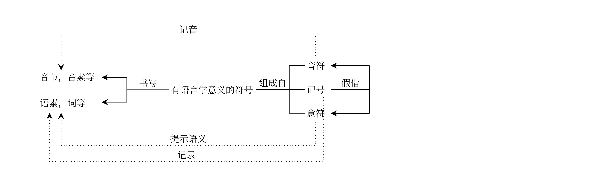
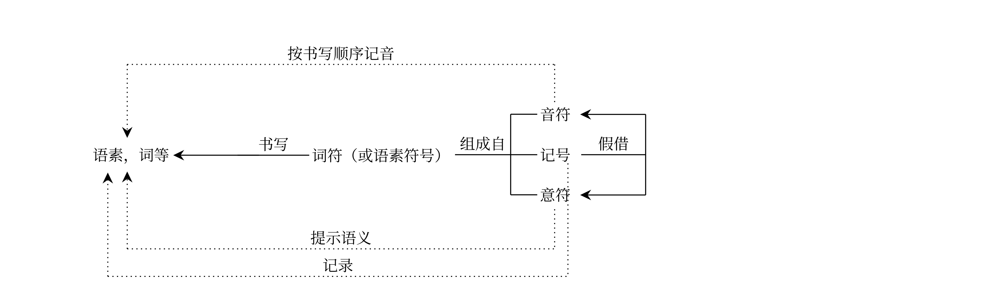

# 语言结构的一般理论

中文语境下的文字学指的一般是汉字学。普通文字学，即对各民族的书写系统的一般性的研究，仍然是一个有待建立的学科，它甚至没有一个固定的英文名（可能叫做grapholinguistics或者grammatology），而且也没有太多一般的理论。我们下面也只关注汉字学，不过现代的汉字学体系确实和对其余书写系统的研究展示出非常惊人的结构相似性，因此一些概念，如意符、音符等，是研究不同的书写体系通用的。

文字表记语言，故而文字学研究不可能完全不顾普通语言学。本文件夹下的classical.pdf的第二章和附录介绍了一个本人认为较为通用的语言描写体系，它是建立在Distributed Morphology和Cartography基础上的。

任一自然语言中大概都有名词性短语、句子等大的构造，这些构造是通过词根和各种语法结构如主谓、述宾等组装而成的。一些语法结构有语法标记。语法结构之间可以嵌套，嵌套的方式有一定的限制，如普通话中大黄狗能说，黄大狗不能说，故可见定中结构其实不是一个单一的结构，而是有颜色定中、大小定中等的区分，颜色定中在外大小定中在内等等。如此，一个大的构造可以看成一个句法树（其中可能还有移位）。然而实际上的言语并不透明地展示句法树，一颗句法树无可避免在表层要被压扁、”分裂“成一系列小单位，即**词**。词有**音系词**、**语法词**之分，音系词靠一个序列内部能否停顿、重音等概念可以判断，语法词的判断则更为模糊，在实际操作上比较依赖形态学过程：如果一些词根和语法标记在表层的语音形式中必须**出现在一起，但又没有明确的句法或者音系上的原因要求这么做**，则这些词根和语法标记大概属于同一个语法词。还有一个clitic的问题，即一些语法标记位置不完全固定但仍然必须黏附在一个语法词上；传统上称为clitic的形式的语法性质差别较大，有的看起来其实比较像前缀后缀、能看到它黏附上去的词的内部结构，有的不行（见Linguistics/Chinese/classical.pdf）。所以其实也未必能有单一的语法词概念，但形态学分析手法大概还是可以跨语言的。

（前述所谓”必须出现在一起“，其实就是DM中post-syntactic操作导致的complex head形成，语法词大概定义为一个极大的complex head；经典的、“后加上去的”clitic是由于local dislocation导致，非典型clitic可能是vocabulary insertion前的过程产生的，在这种情况下affix和clitic的区分大概是来自不同的post syntactic operation）

语法结构的产生和线性化成一串词的过程不是任意的，而要受具体语言的词库的制约。词库提供的制约可以分为几种，一种是词根和语法标记的列表，如有些语言有表示“狗”的词根，但没见过狗的民族是不会有这个词根的；一种是语义的制约，即俗语、成语等，其意思不能由其部分规则地推理出的成分，大小不一；最后一种是形态句法的制约。这最后一种和传统意义上的**词条**的概念最为符合，虽然也有一些出入。如普通话的词根“打”只有用在及物的语法环境里的，从而可以说词根“打”加上及物性是一个词条，其语音是dǎ；又如英语的词根√love有做名词性短语的中心的用法，也有及物的用法，故而√love加上及物性是一个词条，其语音形式是"love"，而√love加上名词性环境是另一个词条，其语音形式与第一个形式相同。这些词条有的可以放在更大的结构里面，然后会有别的东西被挪到它们前后，形成语法词，这就是规则的屈折和派生。然而一门语言的词条可以有不同大小，如英语中√foot只有用来做名词性短语的中心的，其单复数形式不同，从而可以说词根√foot加上名词性环境加上复数是一个词条，其语音形式是"feet"，这个词条和love这样的规则词条大小就不同了。又比如geography中的geo-稳定地占据一个类似定语的位置，所以其实geo-加上“某种低级的定中结构中的定语”的性质也可以看成一个词条，只是这个词条从来不能单独做一个语法词而已。

习惯上这最后一种意义下的一个词条，习惯上也称为一个词。西方古典学中这么一个“词”大体上是一个lexeme，虽然lexeme的概念已经暗示拉丁、希腊语风格的变格变位表格，而我们不做此种暗示；而且一个词条也未必能只加语法标记就形成一个语法词。再者，这最后一种意义下的一个词条未必有不透明的语义，虽然大部分时候它都有。

如上我们概述了分析各种语言均需注意的若干事项，并注意到一些传统的语言学概念，如“词”、“词条”等，其实意义比想象中复杂。又比如词根和语法成分通常合称为**语素**。不过这个概念其实有些模糊，因为它有的时候指抽象的语法成分，有的时候指这些语法成分的语音反映。例如feet算一个语素还是算两个语素（因为大部分英语名词的复数后缀和词干是分开的），又或者其实应该算三个语素（把“名词性”算进去）呢？不过在研究文字学时，这个问题反而简单，因为先民造字时不可能立刻就有对本族语言的非常深刻的结构化描写，故而“名词性”等几乎不可能在文字学上有意义。在研究文字学时，一个词条大约认为是一个语素较为妥当，故以下不做词条和语素的区分。

# 书写系统书写什么？

一个书写系统不大可能给每个句子都指定一个符号，所以大概是要写比较“简单”的东西。

在这里我们需要理清书写系统和语言的两种关系。第一种关系是，一个书写系统中**有语言学意义的符号**（大体上说，一个“字”；裘锡圭称为词符，但一个词符当然可以代表一个语素而不是一个语法词，而且设计良好的音素文字中有语言学意义的符号当然可以只代表一个音素；后面我们会讨论词符的概念）代表的是语言中的什么单位。第二种关系是，一个这样的有语言学意义的符号**何以**就和它代表的语言单位产生关系，这个关系是否是这个有语言学意义的符号的**内部结构**带来的。

这两个参数之间的关系不是必然的，详情见下面的概念辨析。用图表示，大概是下面的情况：

或者，考虑所谓“词符”（见下文）的普遍存在，是下面的情况：

## 参数1：有语言学意义的符号在描写语言中的什么单位

先说一个书写系统中有语言学意义的符号在描写语言中的什么单位。前者可以直接针对语言的语音形式，书写音素、音节、或者两者的混合，或者甚至书写音位，此时我们说它是**表音**的；无论音节还是音素文字，大体上说，都是按照书写顺序记音。不过这个说法有些过于简化，因为完全可以想象先民一开始造字时没有很清楚的音位分析，后来不得不临时创造手段来做一些区分，导致一个单独的音素用两个音符书写（两者分别带有该音素的一些特征），或者用已有的字母组合凑活着模仿一个尚未有专职字母的音位。上世纪五花八门的汉语拼音方案，就是这种窘迫状态的体现。

一个书写系统中有语言学意义的符号也可以针对语言的形态学单位，书写语素或者词。这第二种情况传统上称为是**表意**的，但这个说法是误导性的，因为无疑所谓的表意文字**不表示具体的一个想法**。例如汉字“山”表示的是**汉语的语素“山”**，不是**“山”的概念**：“山”字单用，确实可以表示山这个概念，可是和其他字合用的时候就不对了。汉语的书写形式“黄山”**不是左边表示黄色、右边表示山的画**。如果它是这样一幅画，那它的意思可以做任意的、艺术性的解读，而且也不必从左往右读；然而任何一个母语者都知道书写形式“黄山”有一个具体的读音、并且代表一个定中结构，懂得地理的读者还知道它指的是特定的一座山。所谓“表意”的说法应该被morphographic的概念取代。

这样，有**表音文字**（又分为音节文字、音素文字等），又有**语素文字**。

理论上还可以有表词文字，即允许将一些有内部结构的词整体做书写的文字。一些语言的正字法如果特别混乱，则的确会导致一些符号的组合表词而不表语素；这种情况下实际上这些符号的组合作为一个整体应当看成一个大符号（按下文所说，“记号”），然后这个记号具有语言学意义，而表示一个词。汉字将一些在上古大概彼此有派生关系的词用不同的字书写（如见/现），足见得汉字其实也不是严格意义上的语素文字，而有时表词。

真正字面意义上的表意系统大概不能说是文字。表意系统可能是画而没有确定性的意义，可能是图纸而有确定性的意义，但**不直接表示语言**，或者可能是禁止吸烟等表示一个明确的意义但能产性有限的符号体系。文字学只研究真正意义上的文字，即反映某个时期的语言的符号体系。

语素文字、表词文字中，音符、意符、记号组合成表示单个语素或者词的整体，裘锡圭称为词符。其实表音文字中也往往有词符，例如以拉丁字母、希腊字母、西里尔字母为核心的书写体系都有分词符——一般是空格——于是有orthographic word之说。这个规律不是一定的，如日语的标准书面形式就没有显式的分词符；不过由于日语的语法标记使用假名书写，靠观察假名的位置，其实还是能做到分词的。

词符在所有书写系统中的广泛存在意味着一个很有趣的事情。由于表音文字很少是基于严格的音系分析的（即使基于音系分析，也会随着时间流逝而和口语不匹配），只表音、不表语素/词的文字系统，似乎是不存在的：设计不规则的表音书写体系其实应该算是具有语素文字的性质，因为学生不得不学习一堆语音不透明的字母的大杂烩，每个组合都约定俗成地对应一个词或是语素，这正是语素文字的特点；这种情况下每个这种组合其实都是一个**记号**（见下一节），其内部的字母是充数的，不是音符也不是意符（“one”是一个好例子）。

另一方面，纯语素/表词而不表音的文字，大概也是不存在的。汉字表语素、表词，然而从上古开始音译就没少见；不考虑翻译，“我”字字形为锯齿斧而表示代词“我”，是甲骨文开始就如此，可见汉字创立早期，先民即已经开始按照发音来挪用用来写某一个语素的符号来写另一个语素了。

所以“有语言学意义的符号在描写语言中的什么单位”这个问题，实在不能用“表音/语素/词”三选一地回答，而该作下面的回答：“本书写体系表音时主要是表音节的/音素的，表示语法单位时主要是表词的/语素的”。这就是说，当我们问“汉字中有语言学意义的符号在描写汉语中的什么单位”时，应该这么回答：“对现代诸汉语乃至中古汉语来说，汉字是**音节-语素文字**，**对上古汉语来说**，汉字是音节-语素文字，**兼具表词功能**；汉字表语素的用处要比一般所说的表音文字更频繁、更规则”。

## 参数2：一个有语言学意义的符号何以就和其代表的语言单位产生关系

然后现在我们来看，一个有语言学意义的符号何以就和其代表的语言单位产生关系。

一个有语言学意义的符号可能内部有子符号，也可能没有；后者可以看成其内部有一个单独的符号。我们称能规则地组成一个有语言学意义的符号的那些符号为一个书写系统的**字符**。

这里字符一词的用法遵照裘锡圭的文字学概要的用法，和排版中所谓的字符不是一回事。

这样，**汉字“河”**代表**语素“河”**，而**汉字“河”**内部有两个字符，一个是**字符“氵”**，一个是**字符“可”**。后者本身也可以做一个有语言学意义的符号，但它在汉字“河”中的功能和它本身通常代表的语素没有直接关系。

下面的问题即是，一个有语言学意义的符号中的**字符**和这个有语言学意义的符号代表的**语言单位**之间有何关系。

这个关系有三种情况：意义关系（此时这个字符是一个**意符**），语音关系（此时这个字符是一个**音符**），当然也有音、意都不明的情况，此时这个字符是一个**记号**（如汉字“日”乍一看并不能看出有象形来源）。

意符又可以分成**形符**（象形）和**义符**（非象形）。可是**义符不是记号**：例如汉字“歪”中有不正两个意符，但是它们不是象形符号，但的的确确是意符：它们是意符，因为这两个符号单独用的时候是有语言学意义的符号，所以**的确也有“不”、“正”的意思**。义符其实比想象中多。如汉字“柴”中的字符“木”让人联想到切开的、一块一块的木头，不是一整颗的树，然而汉字“木”做象形理解的时候只可能表示一棵树，而不是切开的木头。

另一方面，记号是完完全全没有办法做任何规则或者半规则的分析的，但仍然可能有内部结构，并且可以作为整体被拿去做别的有语言学意义的符号里面的音符或者意符。

这样，要回答“一个有语言学意义的符号何以就和其代表的语言单位产生关系”的问题，主要是要抓住三种功能是否都存在这个问题。对汉字，我们应该说：“早期汉字是意符—音符文字（所以记号缺失），后来则是意符—音符—记号文字”；而另一方面拉丁字母，不管是哪个语言的标准正字法，大概都是音符-记号文字，意符是没有的。完全缺乏音符的书写系统似乎不可想象，因为如前所述，纯语素/表词而不表音的文字没有自然地存在过。这样就有意符-音符文字，音符-记号文字，意符—音符—记号文字的三分。

## 专职和兼职的符号

前面两个参数其实仍然没有自然地分类所有的书写系统，因为它们还忽略了一个很重要的因素：一个书写系统的最基础的符号如何被用来充当音符、意符、记号。

汉字没有专职的表音符号，所有的表音符号都是临时拿过来一用的。如“加利福尼亚”是一个词符，其中有五个音符，这五个音符的符号用在别的地方有别的用处，不是说“加”就是专门指jiā这个音节。当然现代汉语逐渐开始有专职的音符了，如汉字“伽“几乎从来不会用在音译以外的地方，但是音译的时候，汉字“加”和“伽”的选择其实总的来说是没有一定之规的。一些学科，如希腊研究，会有翻译推荐字表，可是他们尚未将这套标准推动到整个华人社会里面；所以除非这类标准最后有一个胜出了，汉字还是没有真正的专用音符。汉字中的音符，基本上都是有别的用处的符号客串的。

拉丁字母体系反之则没有专职的意符。它有记号，是若干凑数的字母凑成的，但是这不算意符。例如lion一词没有写成lion-animal，但是汉字里面“狮”字有反犬旁。

不过虽然拉丁字母体系里面没有，用本职为表音符号的符号做意符还是做得到的。这种现象称为heterogram。例如对一个懂阿拉米语的巴列维文抄写员来说mlk'是一个意符（义符，显然不是形符），读出来要读作šāh。（对不懂阿拉米语的巴列维文抄写员来说，这就只是一个记号了）

甚至有一种可能：本职表音的符号做意符、和音符放在一起形成一个单独的词符。Ugaritic文本中一些地方的<'il>，有人分析为后置定符，即汉字所谓形旁，即一个单一的词符中表音成分以外的意符。这个是否正确尚无定论。

由于专职和兼职符号搭配的不同，“表音文字”、“表意文字”等名目虽然有误导性，但还是可以科学定义的：后者可以**定义为**有大量意符且这些字符本职工作就是意符的书写系统。