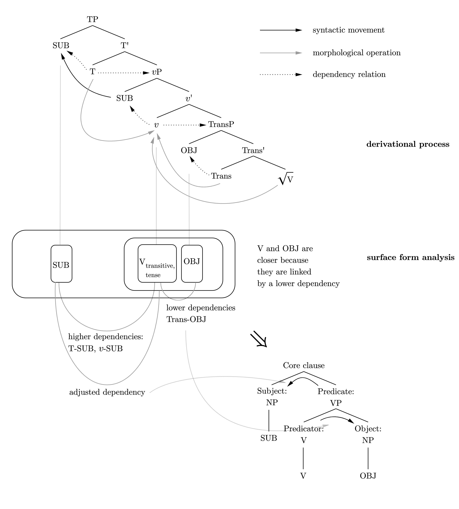

Reading note of Cambridge Grammar of English Language
======

I'm quite struggling with Quirk et al (1985) for several reasons. 
- The authors often do not distinguish the inner structure (category, for example) and the position in a larger structure of a constituent. For example, 
  what does the term *adverbial* mean? Simply adverbs plus prepositional phrases, or a specifier in the TP layer? 
- Similarly, syntax and semantics are mixed together.
- Not much justification is given for proposed analysis. 

The Cambridge Grammar of English Language (Huddleston and Pullum 2002, henceforth CGEL) seems more appropriate 
for people like me. My personal idea is the latter is more "generative" and "BLT-like" - actually less 
BLT-like than generative, considering that most reference grammars don't insist on binary tree diagrams. 

# Terms and organization of grammar

The description framework is introduced in 1.4. Here is a sketch of the system: 
- The grammar is not a semantic-first one: see the "Imperfect match between syntax and semantics" in 4.5.1.
- It's a context-free constituency grammar (without unbounded movements, etc.) with mostly binary branching, 
  but also unitary branching. This seems to be only suitable for languages analytic enough, or otherwise 
  incorporation processes like morphological causative will break the binary analysis easily. (We will discuss this later) 
  Oracle bone script, for example, often involves more than 3 arguments, aligned in the form of S V O1 O2 O3,
  which can be analyzed in a binary way if we consider the *derivation tree* of vP, but the grammar for the 
  surface form is obviously not binary branching. So "describe a language in its own term" makes more sense 
  in descriptive grammars.
- It's mostly lexicalist. In other words, affixes are not in the tree. Since English is already analytic 
  enough, this don't deviate from generative morphosyntax traditions like Distributed Morphology. 

- The labels in non-terminal production rules contain *both* the *category* and *grammatical function* of 
  a constituent. An example can be found in 1.4.2.3 [11]. Here the production rules involved are
  1. Clause → Subject:NP Predicate:VP
  2. Subject:NP → Det:D Head:N
  3. D → *a*
  4. N → *bird*
  5. Predicate:VP → Predicator:V Object:NP
  6. V → *hit*
  7. Object:NP → Det:D Head:N
  8. D → *the*
  9. N → *car*

  With these annotations, we find [11] can be easily transformed into an "ordinary" constituency tree as is in
  Penn Treebank by just erasing the grammatical function labels. On the other hand, after we annotate some words
  as heads (this step is necessary - see below), [11] can also be easily
  transformed into a dependency tree by a bottom-up fashion. This shows the duality between constituency trees
  and dependency trees (Nilsson and Nivre 2008, among others).
- It should be noted that natural language grammars are not context free as a whole.
  A famous example is about how cross-serial dependencies are treated. In derivational syntax they mostly come 
  from movement (because movement somehow "destroys" the constituency structure in a PSG). Derivational cross-serial
  dependencies are not necessarily reflected in the grammatical complexity of the formal grammar of the surface
  structure - it just changes the dependency annotation rules. (For example, English structures investigated in
  is largely context free (Pullum and Rogers 2008).) But in Swiss German, scrambling of objects
  in verb embedding structures creates cross-serial dependencies which are morphologically *marked* in case,
  so the dependency relations created in the derivation process are now marked in the surface form, and 
  the grammar of the surface forms is context sensitive (Shieber 1985). In the terms of dependency relations, 
  it usually comes from cross-serial dependencies with morphosyntactic marking, while in the terms of 
  constituency relations, it usually comes from movement from a canonical order. Both of them arises 
  from derivation processes involving internal Merge in generative syntax. Indeed, derivational Minimalism
  is more expressive than CFG (Michaelis 1998) and we see that's necessary.
- Now we discuss how phrase structures and dependency relations can be defined for surface forms according to 
  the derivational tree associated to them. 
  Briefly speaking, we follow the following rules. An example of the derivation of [S [V O]] tree 
  is displayed here:
  
  - If in the derivational tree, a subtree T is in the projection of a feature F, we say T and F have a 
    dependency relation. For example, in the vP structure of a transitive verb, the subject NP has an "agent" dependency
    relation with the Do head, while the object NP has a "transitive theme" dependency relation with the Trans head.
  - If F is phonetically realized as (a part of) the word W and T is phonetically realized 
    as a part of constituent C, and F and T has dependency relation R, then we say W and C also has the relation R.
    For example, in English, the verb root, the Trans and Do heads are all merged into the main verb, so the main 
    verb has a "transitive theme" dependency relation with the object NP and an "agent" dependency relation with 
    the subject NP. The tense feature is also merged into the main verb, so the main verb has an "subject" 
    dependency relation with the subject NP.
  - It can also be seen that constituency relations derived from the derivational tree have been encoded in 
    these dependency relations. If α and β are in the same projection, then they both have dependency relation 
    with the head (in the generative sense) of the projection. For example, both the direct and the indirect object
    have dependency relation with the light verb, which reflects the fact that they are both generated inside vP. 
    Movement will create discontinuous constituency relations. When drawing trees, we need to pick up a 
    *subset* of constituency relations (as is defined by the dependency relations) that don't involve cross-serial
    dependency and that defines a tree the terminal nodes of which gives the attested word order. 
    Then we add information about the movement from the canonical structure (in the language of constituency) 
    and/or cross-serial dependencies (in the language of dependency) after we finish the tree.

    Now here comes the problem that the morphological merger *blurs* the 
    constituency structure. For example, in English positive clauses, T is merged into the main verb, so 
    with just dependency relations defined on Ws and Cs we are unable to tell whether we should put S and V 
    into a constituent or put V and O into a constituent. Indeed, this leads some people to reject 
    the notion of binary dividing in syntactic analysis and use "flatter" rules like S → NP V NP instead. 
    To transfer the binary hierarchy in the derivational tree to the tree diagram of the surface form, 
    we need to give each dependency relation a label reflecting their places in the derivational tree.
    Two objects linked by a lower dependency relation are considered as forming a constituent, which 
    is the surface representation of the constituent containing these two objects in the derivational tree.
    So we find indeed we need to analyze V and O as a constituent, which is the representative of 
    roughly the vP layer. [S [V O]] is roughly the representative of the TP layer. It's possible, 
    for example, the T head is also attached into the [V O] constituent, which has dependency relation 
    with the subject. After recognizing the constituent status of [V O], we need to adjust the dependency
    relation between T and the subject: we need to recognize a dependency relation between [V O] as a whole 
    and the subject, so that dependency relation can be annotated together with category labels, resulting 
    in the production rule
    > Clause → Subject:NP Predicate:VP

    When there are just *too many* movements - be them phrasal or morphological - binary branching is no longer a feasible analysis for the 
    surface forms. For radical free word language, there are plenty of 
    discontinuous constituents, which may arise because of pronominal argument hypothesis or 
    a lineraization process that doesn't reflect the structure of the derivational tree (dual structure hypothesis),
    and dependency relations that are without cross-serial dependencies and therefore can be used to recover
    a tree structure of constituency relations in the surface form 
    can only build a flat tree. From another perspective, in these languages there is no canonical word order,
    and the word order predicted by any of the binary branching grammars is just too restrictive, 
    so a binary branching tree with the order of terminal nodes doesn't make sense. Certain obligatory movement
    also destroys tree-like constituency relations without cross-serial dependencies. For example, there is no 
    reasonable binary tree analysis of a VSO language, where V has closer relation with O but is closer to S.
    In this case, the movement of V is too *long* for a binary branching tree.
    In English, both light verbs introducing the direct and the indirect objects are incorporated into the 
    main verb, and the main verb moves to the outmost light verb position, so we have two dependencies, one being between V and Od, the other being between V and Oi. In this case we are able to build a binary tree in the form
    of [[V O] O], but it doesn't tell us much about how the structure is derived, so for many a triple branching is
    more appropriate. 
   - We already know it's possible that one element fill two positions in the tree, which is due to movement.
   In case the two positions are close - for example, *some* in *some of the students* is both the "head" (in 
   the sense of CGEL, not generative syntax - see below) and the determiner - this **function fusion** can be
   represented diagrammatically. Whether or not show a function fusion is more about convention. But 
   it's easy to see that function fusion of *some* in *some of the students* doesn't involve cross-serial
   dependency while wh-movements does, so probably it's a good idea to show the function fusion of *some* on the
   tree diagram.
   - It's worth noting that dependency relations used above to build trees links a head (and its realization) or a constituent with 
    another *constituent*. In the above transformation work from a Minimalist derivational tree
    to the kind of grammar used in CGEL, a lot of information about dependency relations is thrown away: 
    in the example of [S [V O]], the dependency relation between the subject and the *verb* (not VP) is ignored
    and replaced by the subject-predicate dependency. If we want to turn the CGEL tree to a dependency tree,
    we need to make clear what's the head to establish word-to-word dependency relations from constituent-to-
    constituent or word-to-constituent relations. 

- Just like the case of effective theories in condensed matter physics, several apparently different 
  phenomenological models all work fine and are dual to each other and are just reflections of a deeper theory in linguistics.
  We can still insist on binary branching in the surface grammar, or we can accept a flatter analysis, 
  as is employed in more functional-typological literatures ("basic linguistic theory"). We can also 
  rearrange constituent relations according to dependency relations. For example, we can rearrange the 
  auxiliary verbs and the main verb into a "verb phrase" as is defined in Quirk et al 1985. The approaches 
  in the two CGELs - Quirk et al 1985 and Huddleston and Pullum 2002 - are both satisfactory from 
  a generative perspective because they are just based on different dependency relations, all of which
  are derived from the underlying derivational trees. 
  
  One particular tree-diagram analysis has to throw away some dependency relations. What are thrown away
  may also include some *locality* information regarding these dependency relations. 
  Quirk et al 1985 don't rank the dependency relations according to their positions in the TP-vP 
  projections, so the resulting surface form grammar is like
  > Sentence → Subject Auxiliary1 Auxiliary2 ... Verb Object

  and since we have dependency relations between auxiliary verbs and the main verb, the next step - quite  
  logically - is to place all of them into one constituent and name it as the "predicate", or, as Dixon
  requires, "the verb phrase", which is CP minus all arguments, or the CP *phase*. So what Quirk et al 1985
  can't directly show is the *order* of dependency relations in the Minimalist derivational process, 
  and what it emphasizes is the *locality* of these relations: the dependency relations between the 
  auxiliary verbs and the main verb are created in the same phase, and therefore are somehow "stronger".
  (Actually, my guess is that the locality and structural order parameter of dependency relations 
  are *all* information given by the Minimalist derivational tree)
  
  On the other hand, Huddleston and Pullum 2002 insists to reflect the *order* of the dependency relations, 
  which results in a binary tree analysis:
  > Sentence → Subject [Auxiliary1 [ Auxiliary2 ... Verb Object ] ]

  but in turn, something has to be thrown away - the close relation between all verbal elements which are
  created in the CP phase has to be shown in an indirect manner. 
- The term **head** here means "a constituent in its parent constituent that decides the distribution of the whole
  constituent". Constituents attached to it are called **dependents**. There are *dependency relations* between 
  the head and the dependents. But here, along with the generative literature, articles like *the* 
  obviously is the head. Suppose a dialect of English requires an article for each nominal expression - just like the case in Greeks. 
  Then in this dialect, the presence of an article means a nominal expression is able to fill an argument slot,
  while the absence of an article means the nominal expression can't appear in a full sentence (but it may still 
  occur as a vocative expression). In this way, obviously the article is the head of a nominal expression. 
  Now we loosen the requirement and go back to standard English. We see the role of articles isn't that different 
  with our imaginary dialect, so it seems we need to analyze the article as the head.

  Of course, the DP hypothesis is simply too striking for most readers. Since the *nominal* (in the sense of 
  the present grammar) contains most contents in an NP and therefore may be considered as *determining* that 
  the phrase is an NP. This is also satisfactory from the generative aspect, since the categorizer (as is in
  Distributed Morphology) *n* is in the core noun.

  So here comes the problem of the status of *prepositional phrases* (discussed in Chapter 7, where the head status of the 
  preposition is claimed from the beginning). As Dixon says, if the preposition can be seen as the head, then so 
  can the case ending. It seems, then, since readers of a descriptive grammar will accept an analysis in which the 
  *main content* of a phrase is considered as the head, the case ending should not be considered as a head, then neither should the preposition. But in English, things are kind of different, because the presence of 
  prepositions makes an NP *robustly* eligible to serve as *modifiers*. What makes this fact particularly 
  interesting is that modifiers seems to be more *predicative* - see discussion on *verbless clauses* in 14.10.
  This means prepositions are more *weighted* then their semi-case marker peers in, say, Latin. 

  Section 15.1.1 [7] gives an asymmetric analysis of coordination, which is frequently seen in generative papers.  
  But for the same reason not to shock readers not familiar with generative jargons, again the coordinator 
  is not analyzed as the head.

  Our summary here is the notion of "headedness" cannot be determined without stipulating any theoretical framework.
  In particular, the notion of heads and dependents in English grammar (as well as dependency annotations in
  treebanks). It doesn't really matter, though, because it's quite easy to switch from one head annotation rule
  to another: in the formalism employed here, all we need to do is to rewritten the "grammatical function" part 
  of PSG labels. That's why for structures like coordination where head is only easily definable for the
  derivational tree, the authors simply ignore the notion of headedness and classify them as non-headed. 
  In dependency grammars things are a little more complicated, because we need to assign a head for every
  constituent so that dependency arcs can indeed form a tree, and to make the notion of dependency arcs
  closer to traditional views, we also need to change the root
  node of a dependency tree and change the direction of all dependency arcs. 
- The term **adjunct** roughly corresponds to *adverbials* in Quirk et al (1985) but strictly denotes *optional*
  ones. Obligatory adverbials are also considered as complements (see 2.8). But on the other hand, both optional
  adverbials (*adjuncts*) and obligatory adverbials (*manner, temporal, etc. complements*) are discussed in 
  Chapter 8. For example, 8.2.1 contains a section about "Manner complements". 
- **Canonical form** See 2.2. In modern Minimalist syntax, the notion of "canonical" word order no longer makes 
 sense because the  syntactic trees are *derivational*: non-canonical sentences are *not* transformed 
 from canonical sentences. Instead, all sentences are built from features in a cyclic-successive way. 
 But for descriptive tasks, it's often useful to distinguish a canonical structure, which better reflects 
 the skeleton of the derivation procedure.
- Just like our above discussion about the descriptive framework of syntax, different ways of how morphology 
  is presented are not necessarily contradictory to each other. **Word paradigm** in Huddleston and Pullum 2002 is
  kept as small as possible - see 3.1.2 [5] for the criteria. On the other hand, the traditional paradigm shown in 
  3.1.2 footnote 1 gives a rather Latin-like description of the verb form. This seems unnecessary for modern 
  English, but since historically English did have rich verb morphology, from a comparative aspect, the 
  traditional table may still be of some use. A concise word paradigm is only about the final stages of
  morphological processes and leaves the rest to the syntax chapters in the rest of the grammar, while a
  traditional, "large" word paradigm is a mapping from the full feature structure to the final outputs,
  without any analysis of intermediate stages. Both are good phenomenological models. We can even put some
  syntax into the word paradigm. For example, we can summarize the possible values of a verb phrase in the 
  sense of Quirk et al. 1985 as an "English verb conjugation table", just like [this Wikipedia page](https://en.wikipedia.org/wiki/Uses_of_English_verb_forms).

# References

Huddleston, Rodnry and Pullum, Geqffrry. 2002. The Cambridge Grammar of the English Language. 

Michaelis, J. 1998. Derivational minimalism is mildly context–sensitive. In International Conference on Logical Aspects of Computational Linguistics (pp. 179-198). Springer, Berlin, Heidelberg.

Nilsson, Jens & Nivre, Joakim. 2008. Dependency Parsing by Transformation and Combination. 348-359. 10.1007/978-3-540-85287-2_33. 

Pullum, G. K., & Rogers, J. 2008. Expressive power of the syntactic theory implicit in the cambridge grammar of the english language. In annual meeting of the Linguistics Assocition of Great Britain, University of Essex.

Quirk, Randolph, Sidney Greenbaum, Geoffrey Leech, & Jan Svartvik. A Comprehensive Grammar of the English Language, Longman, 1985.

Shieber, S. M. 1985. Evidence against the context-freeness of natural language. In Philosophy, language, and artificial intelligence (pp. 79-89). Springer, Dordrecht.
