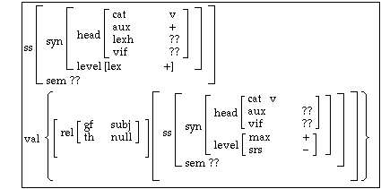

有什么瞬间让你觉得你对语言学的爱欠费了
======

这个回答可以算是Articulatum的回答的一个部分的拓展，主要是吐槽语言类型学——或者更加广义地说，“比较语言学”（如同[Haspelmath的这篇博客](https://dlc.hypotheses.org/1915)所说的那样）——中的完全不必要的隔阂。
在这个名头下面可以有三种——实际上是四种——理论：
- 原则与参数的生成语法。虽然生成语法学家经常一次只研究一种语言（这是一个有些糟糕的地方——见后文），但是生成语法背景下的类型学研究并非没有。
- 所谓的functional-typological approach，或者说“Greenberg式的类型学”。很多这一领域的语言学家本身都开发过usage-based的理论，比较著名的包括Croft(2001)和Bybee(2010)，当然这远远不是全部。
  类型学研究者不会尝试使用语言在心智中的表征来构建理论，他们喜欢功能主义的解释当然也就不足为怪了。应该注意的是，不懂usage-based的理论**不意味着**你就不能够做Greenberg式的类型学，因此。
- 纯粹的语法描写，如Dixon的Basic Linguistic Theory

上面列出的几种理论并没有包括HPSG，LFG这样真的能够做到非常精确的形式化的理论。总的来说，主流语言学中，和编译器中的语法一样rigid的形式语法不是主流，对生成语法学家和功能主义语法学家来说都不是主流。
应注意，严格的形式语法并非毫无作用——实际上，无论是最简方案还是构式语法都有各自的严格实现。但由于语言学方法在NLP中被统计方法打得丢盔弃甲，两者都没有什么工业应用。
最简方案的形式化实现主要用于解释一些心理语言学问题，如Stabler(2013)和De Santo(2020)就使用一种形式化方案，所谓的Minimalist Grammar，解释了为什么完全不包含概率信息的语法知识也能够导致模糊不清的句子合法性判断。
构式语法同样有严格实现（如Steels 2012），但是我并不了解这是干什么用的，就不妄加评论了。

# The shrinking Chomskyan corner

# usage-based理论的支持者是否陷入了自相矛盾？

既然生成语法不甚可靠，很自然的想法是，我们应该转向所谓的usage-based approach。有很多不同的usage-based方法。广义地说，HPSG和LFG这些也可以算usage-based方法

usage-based approach的一个很重要的卖点就是无需假设先天的语法知识就能够解释很多的语言现象。因此，根据奥卡姆剃刀的原则，似乎usage-based approach是优先于生成语法的。
在这里我们需要界定“先天”的意思：人的思维毕竟不可能真的是一张白纸，你生下来如果只是看着一行行程序代码，是不可能自然地习得编程语言的。
因此，任何的基于认知能力的语法理论都或多或少需要先天的东西。真的有争议的是这些先天的认知能力是不是仅限于语言的：如果先天的认知能力是在任何领域都通用的，那么“普遍语法”的说法就会显得很奇怪，因为婴儿的先天知识并不真的是语法知识，正如塑料不是塑料椅子一样。
因此，usage-based approach，从口号来说，只需要domain general的认知能力就能够解释各种语言现象了。

但是，虽然嘴上这么说，我们翻开比较理论化的usage-based的文献，会感到事情并不是那么一回事。随便搜索“construction grammar”对应的图片，你可能会搜出来[这样](https://www1.icsi.berkeley.edu/~kay/bcg/lec04.html)的东西：

另一方面，眼下的生成语法假定的先天的、
归根到底，我们对人如何认知世界还是很不清楚的，因此任何和认知科学有关的语法理论都必然要试图使用一些关于人的认知能力的抽象模型——在生成语法中是Merge和spellout，在构式语法中是结构-意义对和构式，等等。
因此，任何一个这样的理论在实际的方法论上都和明确主张domain specific的理论没有特别大的差别。

奥卡姆剃刀的论证在另一个地方也存在毛病，就是人体的功能结构本身并不是非常优雅的。大脑可以调控运动，但是运动协调性则和小脑有关。确实有这样的可能，就是domain general symbolic ability完全能够cover我们的语言能力（废话，否则我们就不能够理性地来给语言写语法了），但是当人们足够熟练以后，产生句子的能力就被更加直觉性的认知模块接管了。
这个更加直觉性的认知模块的生成能力可能是有限的——比如说，按照Minimalist Grammar的说法(Michaelis 1998)，是mildly context sensitive。
因此，够格被称为“自然语言”的交流系统的语法长远来看确实是要受到一些先天的、语言相关的因素的制约。
这样，虽然功能主义的理论没有错，但是生成语法总也还是对的。事实上，这正是Haspelmath(2019)中提到的可能性：语言普遍性可以通过多个层面的约束得到解释，功能主义的解释大部分情况都是够用的，但是representational constraint也会发挥作用。

这么说，构式语法相对于生成语法的优越之处可以说是前者更加灵活，能够不费很多力气就捕捉到很多语法现象，并且能够做功能性的解释，可是生成语法其实也并不排斥功能性的解释，至于语法的描写能力，直接抛弃理论语言学的框架，使用更加informal的体例写语法不好吗？

此外，比较理论化的usage-based theory同样会面临和生成语法类似的问题：不尊重语言事实的研究者沉迷于炒作概念和对孤立的语言事实做任意的解释。
我觉得这个问题

# 类型学是否是唯一出路？

# 语法描写在过去几十年的傲人成就——以及不那么傲人的地方

# Towards a generative-functionalist-typology?

# 参考文献

Bybee, Joan L., and Clay Beckner. 2010. Usage-based theory. The Oxford handbook of linguistic analysis.

Croft, William. 2001. Radical construction grammar: Syntactic theory in typological perspective. Oxford University Press on Demand.

Davis, H., Gillon, C., & Matthewson, L. 2014. How to investigate linguistic diversity: Lessons from the Pacific Northwest. Language 90(4), e180-e226.

De Santo, Aniello. MG parsing as a model of gradient acceptability in syntactic Islands. 2020. Proceedings of the Society for Computation in Linguistics 2020.

Everett, Daniel L. 2013. The shrinking Chomskyan corner: A final reply to Nevins, Pesetsky, and Rodrigues. LingBuzz eprints 994.

Haspelmath, M. 2019. Can cross-linguistic regularities be explained by constraints on change?. In Explanation in typology: Diachronic sources, functional motivations and the nature of the evidence (pp. 1-23). Language Science Press.

Michaelis, Jens. 1998. Derivational minimalism is mildly context–sensitive. International Conference on Logical Aspects of Computational Linguistics. Springer, Berlin, Heidelberg.

Stabler, Edward P. Two models of minimalist, incremental syntactic analysis. 2013. Topics in cognitive science 5.3: 611-633.

Steels, Luc, ed. Computational issues in fluid construction grammar. 2012. Springer.
