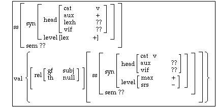

有什么瞬间让你觉得你对语言学的爱欠费了
======

这个回答可以算是Articulatum的回答的一个部分的拓展，主要是吐槽语言类型学——或者更加广义地说，“比较语法”（如同[Haspelmath的这篇博客](https://dlc.hypotheses.org/1915)所说的那样）——中的完全不必要的隔阂和无意义的互相指责。
在这个名头下面可以有三种——实际上是四种——进路：
- 生成语法。虽然生成语法学家经常一次只研究一种语言（这是一个有些糟糕的地方——见后文），但是生成语法背景下的类型学研究并非没有：Cinque(1999, 2005)就是典型的例子。
- usage-based的理论语言学，包括形形色色的功能、认知、构式语法。
- 所谓的functional-typological approach，或者说“Greenberg式的类型学”。很多这一领域的语言学家本身都开发过usage-based的理论，比较著名的包括Croft(2001)和Bybee(2010)，当然这远远不是全部。
  应该注意的是，不懂usage-based的**理论**不意味着你就不能够做Greenberg式的类型学。
  类型学研究者不会尝试使用语言在心智中的表征来构建理论，而usage-based的理论语言学虽然抨击生成语法，但是它们自己也是心智主义的，因此类型学中所谓的“功能解释”往往是一些比较浅层的功能解释，不会试图拿这些解释复现出所有语言现象。
  这也就是我将functional-typological approach分出来讲的原因。实际上，因为乔姆斯基本人的意见和主流生成语言学愈发地脱节，我很怀疑很多生成语法学家引用类型学家的“functionalist”理论比引用乔帮主本人的作品要频繁得多。
  正如[Hornstein的这篇博客](https://facultyoflanguage.blogspot.com/2018/09/generative-grammars-chomsky-problem.html)所说，现代语言学的主保圣人是Greenberg而不是乔姆斯基。
- 纯粹的语法描写，如Dixon(2009)的Basic Linguistic Theory。Dixon本人同时也是类型学家，不过很多语法撰写家和看不起生成语法一样地看不起类型学（如Evans and Levinson 2009, van Driem 2007），因此我们需要将语言描写再单独列出来。

上面列出的几种理论进路并没有包括HPSG，LFG这样真的真的很形式化的理论。总的来说，主流语言学中，和编译器中的语法一样rigid的形式语法不是主流，对生成语法学家和功能主义语法学家来说都不是主流。
应注意，严格的形式语法并非毫无作用——实际上，无论是最简方案还是构式语法都有各自的严格实现。但由于语言学方法在NLP中被统计方法打得丢盔弃甲，两者都没有什么工业应用。
最简方案的形式化实现主要用于解释一些心理语言学问题，如Stabler(2013)和De Santo(2020)就使用一种形式化方案，所谓的Minimalist Grammar，解释了为什么完全不包含概率信息的语法知识也能够导致模糊不清的句子合法性判断。
构式语法同样有严格实现（如Steels 2012），但是我并不了解这是干什么用的，就不妄加评论了。

# The shrinking Chomskyan corner

我觉得，说生成语法（相比于它在1960到1980年代的全盛期）陷入麻烦了，基本上不是什么有争议的事。每一个地方都在漏水。语料的不可靠是非常要命的问题。
黄正德的汉语生成语法研究经常受到质疑：“A把B抢了一顶帽子”显然不合法，但是就堂而皇之地在书里面出现了。（据说黄正德的汉语是闽南语和台湾国语混出来的，不知道是不是。我个人认为黄正德其实是诚实的，因为很多时候，把他那些莫名其妙的语料扔掉，剩下的语料可以更加**容易**地解释……）
内省语料的不可靠之处可见一斑。句法实验是一种弥补这种缺陷的方法，但很多时候，如果缺乏对一种语言的融贯了解，设计出来的实验也会充满loophole。

下一个有争议的地方是普遍语法。在这里我不太想深入讨论这个话题，一方面是因为就目前的认知科学的发展，讨论这个问题没啥意义，一方面是因为现在的生成语法坚信不疑的是先天的东西——Merge，spellout，约束条件主要在句法和别的东西的接口上——并不是特别强的假设。
原则上，生成语法应该讨论形式普遍性——人类语言能力不能直觉性地生成特定的结构(Hornstein 2018a)，即what's possible——而不是实质普遍性，即what's probable（类型学的研究对象），因此，（经常是功能主义的）语言类型学和生成语法是**互补**的而不是互斥的(Newmeyer 2005, Haspelmath 2019, Boskovic 2021)。
但是这和生成语法**实践**中常见的方法论是彼此冲突的，因为如果我们只是盯着单种语言一通分析，没人知道分析出来的结论是不是足够普遍，更别提形式普遍性还是实质普遍性了(Haspelmath 2020)。
管辖与约束的理论显然就犯了这个错误：今天，讲到Principles A, B, C，我们一般会把它们当成效应，它们如果说反映了什么形式普遍性的话，那么应该说反映了句法树是“分层”的，或者说某种形式的phase theory成立；但像英语中这样，完美满足Principles A, B, C的反身代词未必在所有语言中都是存在的。
还有一种生成语法研究是使用在别的语言中测试成立的规律来解释一种特定的语言中的现象。但是一方面，我们已经说过，语料本身的可靠性就是问题，另一方面，这经常导致拙劣的curve fitting。黄正德之前好像还说汉语有不定式，然而不定式本身是不是跨语言广泛存在就是一个问题，不同语言中的“不定式”行为也有所不同。
因此，这两种生成语法研究的学术价值都是不高的。

生成语法实践中的这种方法论缺陷导致了这个领域的研究热点一直在不断地变动，一个热点炒一阵，然后消失，在principle and parameter的时代出现大量parameter，在最简方案时代出现很多莫名其妙的推导机制，使人很怀疑是否这些东西真的全是先天的——所谓的Darwin's problem (Haspelmath 2020)。已经提出的各种解释也经常自相矛盾。
在五个人有六种意见，所有人的注意力都在他们自己发明出的各种千奇百怪的metalanguage的当下，生成语法真的能够促进对语言的深入了解吗？
Everett(2013)对生成语法的攻击虽然有些极端，但确实可谓一记警钟。乔姆斯基革命在60年后的今天，真的带来了很多进展吗？

总之，如果（最简方案的）生成语法的纲领被无可挑剔地执行了，那么可以得到一些比较坚实的结果，可是这样研究难度非常大，得到的结果不多，并且得到的结果并不是一般人想到语言学时会关心的（正如建筑师不需要手推太多固体力学的公式一样）。
那么，似乎最好把生成语言学家解雇大部分，剩下几个比较靠得住的人打发到隔壁心理学系去。这样，作为一个语言学理论的生成语法就变得不那么有趣了。
如果生成语法的纲领配合上了有风险的方法论，那么可以得到很多有趣的结果，但是这些结果经常是很容易就被证伪了（如原版的Principles A, B, C），要么就是完全无法证伪。（有关的吐槽可以看Preminger 2019）
因此，许多当下的生成语法工作可以说除了激励人们调查各种小众语言的细节以外，价值是不太高的。

# usage-based理论的支持者是否陷入了自相矛盾？

既然生成语法不甚可靠，很自然的想法是，我们应该转向所谓的usage-based approach。有很多不同的usage-based方法。广义地说，HPSG和LFG这些也可以算usage-based方法，狭义地说，功能语法（有好多不同的功能语法）、认知语法（也有很多，名字就叫做“认知语法”的有，名字叫别的东西的也有）、构式语法（同样有很多构式语法，有时候认知语法被归结在构式语法下面，有时候反过来）。

usage-based approach的一个很重要的卖点就是无需假设先天的语法知识就能够解释很多的语言现象。因此，根据奥卡姆剃刀的原则，似乎usage-based approach是优先于生成语法的。
在这里我们需要界定“先天”的意思：人的思维毕竟不可能真的是一张白纸，你生下来如果只是看着一行行程序代码，是不可能自然地习得编程语言的。
因此，任何的基于认知能力的语法理论都或多或少需要先天的东西。真的有争议的是这些先天的认知能力是不是仅限于语言的：如果先天的认知能力是在任何领域都通用的，那么“普遍语法”的说法就会显得很奇怪，因为婴儿的先天知识并不真的是语法知识，正如塑料不是塑料椅子一样。
因此，usage-based approach，从口号来说，只需要domain general的认知能力就能够解释各种语言现象了。

但是，虽然嘴上这么说，我们翻开比较理论化的usage-based的文献，会感到事情并不是那么一回事。随便搜索“construction grammar”对应的图片，你可能会搜出来[这样](https://www1.icsi.berkeley.edu/~kay/bcg/lec04.html)的东西：

可以看到这张图还是直接假定了语言中存在特征结构、中心语、嵌套的构式等概念，这些东西形成了一个理论框架，构式语法学家在这个框架里面工作。
虽然大家假定这些语言学概念存在直接的domain general心理基础（比如说中心语对应注意力焦点，等等），但是并没有特别明确无误的心理语言学证据表明domain general的认知能力**直接**能够产生这些语言学概念。
（Goldberg、Lakoff等人的构式语法据说是比较注重心理上的可行性的，但是可能是因为我不够了解，我确实感觉，这些理论在实际操作中仍然是only pay lip service to cognitive science，和生成语法一样）
另一方面，眼下的生成语法完全不加以怀疑的先天的语法知识恐怕就只有Merge，可能加上spellout，虽然很多生成语言学家会假定所有语言都有vP-TP-CP的三层投射，并且每一层都有Cartography所描绘的细致结构，但是这些实体性的语法范畴是否是domain specific的、是不是一定是完全内置在普遍语法中的、是不是可以有功能性的解释，并没有形成统一意见。
依据这样的说法，在最简方案下工作的生成语法学家——尤其是那些大量诉诸功能性解释而非UG的生成语法家，如Ramchand and Svenonius(2014)，大概同时也是构式语法学家、usage-based支持者了！
归根到底，我们对人的认知能力还是很不清楚的，因此任何和认知科学有关的语法理论都必然要试图使用一些关于人的**一部分**认知能力的抽象模型——在生成语法中是Merge和spellout，在构式语法中是结构-意义对和构式，等等。
因此，任何一个理论语言学理论无论口号是什么，在实际工作时都和明确主张domain specific的理论没有差别。
它们的主要区别还是在于基本的语法操作是什么。（关于一个比较全面的比较，见Müller 2013；作者认为构式语法中的一些操作是必要的，但是很多人并不这么觉得）

奥卡姆剃刀的论证在另一个地方也存在毛病，就是人体的功能结构本身并不是非常优雅的。大脑可以调控运动，但是运动协调性则和小脑有关。确实有这样的可能，就是domain general symbolic ability完全能够cover我们的语言能力（废话，否则我们就不能够理性地来给语言写语法了），但是当人们足够熟练以后，产生句子的能力就被更加直觉性的认知模块接管了。
这个更加直觉性的认知模块的生成能力可能是有限的——比如说，按照Minimalist Grammar的说法(Michaelis 1998)，是mildly context sensitive的。
因此，够格被称为“自然语言”的交流系统的语法长远来看确实是要受到一些先天的、语言相关的因素的制约。
这样，虽然usage-based理论没有错，但是生成语法总也还是对的。事实上，这正是Haspelmath(2019)中提到的可能性：语言普遍性可以通过多个层面的约束得到解释，usage-based的解释大部分情况都是够用的，但是representational constraint——特定的语言结构就是不能够被当成一种**自然语言**，被**直觉性**地处理——也会发挥作用。

此外，比较理论化的usage-based theory同样会面临和生成语法类似的问题：不尊重语言事实的研究者沉迷于炒作概念和对孤立的语言事实做任意的解释。
我觉得这个毛病在很多当代汉语研究中有所体现……
局限在印欧语中，做想当然的推广，是另一个生成语言学中经常出现，然而usage-based approaches也属实是难兄难弟的毛病。

语法化、句子合法性判断中的渐变性同样是usage-based approach的一个卖点。生成语法常常因为过于“僵硬”而受到诟病。如果各种语言学概念都是domain general的心智中的概念，是可以连续流动的，那么句子合法性当然应该是连续变化的，有具体意义的结构语法化就是很自然的过程，无需做competence和performance的区分，等等，非常便利，似乎比僵硬的、在语言演化中只允许突变的生成语法要更加高明。
但是这种说法存在概念错误。首先，一个理论中存在可以连续变动的东西不代表这个理论中不存在一些“僵硬”的结构。
我们拿伊辛模型做一个例子。伊辛模型输出的可观测量——比如说磁化强度——当然是可以连续变动的，但是这不代表伊辛模型中不存在僵硬的结构：无论如何，每个自旋要么朝上，要么朝下，给定一个自旋构型，总能量可以无歧义地直接算出来。
是热涨落带来了连续变动，连续变动是存在的，僵硬的结构也是存在的；虽然热涨落会带来很多有趣的现象——也许是**大部分**有趣的现象，比如说相变——但是无论如何僵硬的结构确实是**可能存在**的。
生成语法学家就好像不写蒙卡模拟而只是玩零温的严格可解模型的凝聚态物理学家。说“他们研究的东西不是一般人对语言会关心的东西”，这是一个公正的指责，说“他们追求的东西**必然是**妄想”，并不是一个公正的指责。

总之，构式语法相对于生成语法的优越之处可以说是前者更加灵活，能够不费很多力气就捕捉到很多语法现象，并且能够做功能性的解释，可是生成语法其实也并不排斥功能性的解释，至于语法的描写能力，直接抛弃理论语言学的框架，使用更加informal的体例写语法不好吗？

# 理论中立的类型学和语法描写——它们的辉煌成就，和不那么辉煌的地方

于是，看起来，所有理论语言学（[Haspelmath的这篇博客](https://dlc.hypotheses.org/1915)同样也反对“理论语言学”这个说法，不过我们姑且用“理论语言学”指比较依赖理论框架的工作）都是不甚可靠的。
我们应该像伟大的田野调查工作者R.M.W. Dixon一样，将语言描写和框架中立的类型学作为语言学的根本。

不过且慢，是否真的有一个统一的“语言描写和框架中立的类型学”的阵营？

至少Haspelmath和Dixon就会有不同意见。前者(Haspelmath 2010)认为跨语言比较不能够基于任何特定于具体语言的语法范畴，而只能先对每种语言做独立的描写，然后依赖于将前者“粗糙化”得到的一系列comparative concepts做类型学。
这些comparative concepts如果能够导出可靠的language universal，就是有价值的，反之，就是没有价值的；它们和具体的语言中存在的语法范畴没有必然的关系。
因此，语言类型学和语言描写是相对独立的（当然，和生成语言学追求的形式普遍性也是彼此独立的）。
Dixon和van Driem也会有不同意见，前者强调类型学的价值，后者在van Driem 2007中强烈地拒斥所有试图寻找语言普遍性的做法。

我们首先讨论Haspelmath的独立于具体语言的语法的类型学。正如Boskovic 2021指出的那样，简单地将关于具体语言的概念和类型学中用于比较的概念对立起来是存在逻辑困难的。
我们可以拿语音学来做比喻：具体的语音形式才是真的看得见的，但是这并没有让“音位”的概念变得更加不真实，而在做谱系树分析的时候，我们会说“原始某某语中的某某音位变成后代某某语言的某某音位了，现代的某某语言和某某语言的两个音位是对应的”等等。
因此，所谓“类型学中用于比较的概念”被提出时也许是纯粹的理论假设，但是它在具体的语言中也可能有一定的真实性。实际情况很可能是，一个用于跨语言比较的comparative concept虽然在提出时是纯粹的理论建构，但实际上的确反映了不同的人类语言中都存在的一个“原型”的语法范畴。
例如，不同语言的“名词”和“动词”涵盖的范围是不同的，但是无论如何，我们可以抽象出“名词”和“动词”的抽象概念用于著有成效的跨语言类型学研究。
对Haspelmath来说，前者是language specific descriptive concept，而后者是comparative concept，两者确实是不同的。
但实际情况可能是，不同的语言都有“原型”的名词——用于填充论元——和动词——用于填充predicate，然后由于各种因素，名词和动词可以**兼任**一些别的职位，如动词可以不经过显式的形态变化而做论元（正如汉语中那样），或者名词可以直接做predicate，但是我们确实**可以**识别出名词和动词的原型职能。（例如，汉语中的状态动词做论元经常读起来很怪，但是做predicate就不受到任何限制）
因此comparative concept的确可以揭示一些跨语言稳定存在的语法范畴。因此，区分comparative concept和descriptive concept是非常必要的，不过是不是两者绝对不能重合则不好说。
区分comparative concept和descriptive concept还可能会招致一定的风险，就是鼓励了只看WALS，不自己动嘴学几句有待研究的语言的行为。

我感到对纯写语法（也许还要加上历史语言学研究）的人发表评论应该尽可能谨慎，因为至少有一点是确定无疑的，就是他们的工作是最为费时费力，同时又能够持续用上**很久**而不过时的。
我们如今仍然在使用的拉丁语语法不少都是上上世纪写的了，他们的学术寿命相比厕纸般出现一阵子然后马上没有人读的理论工作要长得多；而现代的语言记录者们要进入一个人生地不熟的环境，快速学会一门没有什么书写传统的语言，经常需要自行发明术语和分析手法来研究它，写一千多页的参考语法、几千几万个词的词典，每一件事相比他们研究古典语言的同行又要不容易上几倍。
不做扶手椅语言学家、不追潮流炒热点的人是应当受到赞美的！
不过无论如何，我还是想要发表一些评论，因为人们写下来的方法论和他们实际工作中使用的方法论经常有微妙的脱节，而艰苦的工作有时也会有一些不否定其价值的瑕疵。

我们讨论“describing a language in its own term”的口号。这个口号到底是什么意思呢？什么叫做"its own term"呢？
这个说法强调了现代的描写语法和传统语法的一个重大不同：我们不先验地假设格、性、数、动词变位这些概念在所有语言中都存在，而是试图找到最能够贴近待描述的语言的体例来撰写语法。
但是，如果说有生成语言学家没有遵循这一点，那仅仅是因为他们缺乏对待描述的语言的尊重而已——正如我们之前看到的，**所有**理论语言学方法和类型学方法中都有这样的人。
美国描写语言学家有一整套不预期任何语法范畴，直接从形式上切分句子的方法，但是指望这些方法能够**容易地**生效，实际上已经对待描写的语言的形制做了相当强的假设了。
这就好像不同的深度学习任务需要设计不同的网络结构一样；原则上，无论是神经网络方法还是很多别的统计学习方法原则上都能够拟合所有比较正常的函数，但一些知识能够用某种方法**比较容易**地学到这一事实实际上就对输入数据的分布隐式地做了约束了。
因此，虽然描写语言学家会把自己说成完全不加任何假设地描写语言（如果有假设，这些假设是“启发式的”），但是他们当然不可能真的**一点假设也不带**。
Dixon会管这个隐式的语言描写框架叫做basic linguistic theory。他主张这种据说是不预先做任何假设的语言描写范式是最高明的，比生成语法和其它理论语言学范式都要高明。
不预先做太多假设的确是要得到好的科学研究必须的，但另一方面，Dixon却认为“语法作者应当按照basic linguistic theory（作为一个有其原则和纲领的理论）来写语法”。
语法学家能够在**假定很多basic linguistic theory的基本概念**的情况下写出不错的语法（如名词、动词、论元结构、词性变换、论元结构外面的TAM特征，TAM特征再外面的话题、焦点——不需要想太久就会发现这些东西实际上就是Minimalist morphosyntax预设的那些东西，后者可能还要少些），这的确说明了关于人类普遍的语言能力的**一些知识**。
因此，像Dryer(2006)那样，主张主张**只使用**basic linguistic theory就够了，但同时又认为不应该同时做descriptive theory和explanatory theory，是不可能真的做到的；这要理解成是一个方法论上的忠告才有意义，即不能像很多生成语法学家一样对语言没有全局把握就匆匆总结出一些“规律”，使用一种预先已经受到**高度**限制的元语言去描写自然语言，认为这能够构成解释。
但是元语言受到限制这件事本身对语言学理论是有意义的：如果我们发现一种有待调查的语言的语法落在某个高度受限的mildly context sensitive grammar里面，而后者是从别的语言总结出来的，那么我们的确可以部分地解释这种有待调查的语言的语法为什么是现在这个样子而不是别的样子。

我还要进一步冒昧地说，实际上basic linguistic theory(Dixon 2009)对形式主义者的很多指责反映的是生成语法和语言描写之间的术语不共通，而不是什么更加本质的东西。
Dixon嘲讽说，生成语法学家认为有prepositional phrase(PP)，那么拉丁语中难道还有case phrase吗？但这实际上是误解了最简方案中的head的概念和语言描写中head的概念的区别（也误解了两者中phrase的区别）。
最简方案中的head指的是“新近被Merge进句法树、并且让短语性质发生明显变化的（亚）语素”，phrase单纯是maximal projection的另一种说法。
要看出最简方案的句法树和basic linguistic theory中的分析的联系，只需要做如下替换：
- 把最简方案中的一个phase，当成basic linguistic theory中的一个短语；其已经是phase的子树当成这个短语的下级短语
- 把一个phase中所有的head指向都倒转过来

这样，我们就从标准的生成语法的二叉树分析（其中[pres]特征、用于引入论元的轻动词v和Trans、动词词根√LOVE、通过Agree得到的第三人称单数特征同时发生形态学聚合，得到loves）：
  
  [CP [C' C [TP The man [T' [pres] [vP <del>the man</del> [vP v [TransP [Trans' Trans [√LOVE his dog ] ] ]  ] ] ] ] ] ]

得到

  [[The man]agent lovespres, 3sg, one agent argument, one theme argument [his dog]theme ]clause

其中vP和CP层中，倒转所有head关系，发现它们都指向动词——的确，在比较传统的分析中，动词的确是中心语。

再比如（其中F用于引入形容词）：

[PP to [DP the [FP fat [F' F man ] ] ] ]

被自动转化成了（这是Dixon 2009 1.11 (34)的例子）

tobenefactive thedefinite [fat manmodified]definite

我们发现
- basic linguistic theory中要求的比较扁平的短语实际上对应的不是生成语法中随便哪一个maximal projection，而是phase（或者别的cyclicity区段）
- 通过倒转最简方案中的head关系，就简单地得到basic linguistic theory中的中心语

因此，实际上basic linguistic theory和生成语法中的句法树**不矛盾**：后者能够直接推导出前者(Boskovic 2021里面也提过这件事)。他们体现的首先是**记号差异**而已。
由于生成语法学家想要看句法树满足什么样的约束（形式普遍性），由于二叉树中c-command关系的定义是最容易的，他们就使用Merge-based syntax；语言描写专家没有这个需求，于是自然不会使用二叉树的记号。
但是这里没有真正的理论冲突：有的只是不同的关注点和方法论。一些关注点更值得做，一些不容易做出成果，但是它们都是有意义的。

Dixon还为basic linguistic theory中所有的概念都只是可以出现而不是必须出现为傲。但是，形式主义者同样**没有**真的假定**每一个**英语中出现过的概念都必须出现在别的语言中。
例如，Ramchand and Svenonius 2014就认为，Cinque等人的Cartography中的functional projection是来自功能因素，而不是硬编码在普遍语法中。
Wiltschko 2014认为普遍语法中只有一些没有具体内容的抽象的语法范畴（比如说"point of view"），它们和时间、空间等概念结合起来才产生了时态、体态、言据性等实际的语法范畴。
实际上，很多现在的生成语法学家正在变得越来越像类型学家和构式语法学家：大家讨论可以发生微小变化的microparameter、渐进的语法化等理论时丝毫不会感到有问题。
总之，basic linguistic theory和生成语法的语法理论之间不存在冲突。后者的分析可以无缝转化成前者，前者的分析也可以为后者提供新的兴趣点。

而且，说起来，Dixon版本的basic linguistic theory中
- 很少出现全局的标注——和构式语法、优选论不同
- 一般都是多一个语素就多一重标注，比如说the对应definite，to对应benefactive——和functional head依次Merge进句法树，不断改变句法树的性质相同，正好是c-command关系最为平庸的体现
- 短语的概念和phase（or whatever locality unit）对应（或者更一般地说，和一个span对应：考虑如下句子：which student do you like the most in the class，这里，which student在生成时应该是[QP which [FP student [PP in [DP the class] ] ] ]，但是既然in the class可以整体移动成为“句子的状语”，which student就变成一个表层的phrase了）
- Dixon将论元结构、non-spatial setting、sentence-level categories分开来讲，这不就是vP-TP-CP分词吗
- 不是lexicalist的

看起来这还是最接近最简方案的描写理论，只不过换了一个马甲而已。

最后，van Driem 2007对语言描写的整体性的呼吁是非常要紧的。如果理论语言学家只是满足于研究几个他们感兴趣的结构而不注重保存整个语言的语法，那简直是浪费母语老师的时间。
但是如何能够保存整个语言的完整语法呢？完全依赖自然语料和语料库分析，在一些语法细节的描写上是可能出纰漏的。
Davis, Gillon and Matthewson(2014)列举了一些语法理论的提示帮助了语言调查的例子。
Salish一开始被好多人认为是全然没有动词和名词的区别，但当人们开始分析关系从句的先行词的行为的时候，就会注意到有些词好像从来不会做关系从句的先行词。
更加细致的合法性判断表明，Salish还是有一定的名词和动词的区别的。
那么，虽然刚开始语言调查时的确应该编写非常完整的、方方面面都触及的语法，当需要进一步摸清楚细节时，elicit、合法性判断、句法实验等生成语法常用的手法是有益的（虽然必须小心），而语法理论——对what's impossible的猜测——也可以给“下一步调查什么细节”提供灵感。

总之，正如（来源想不起来了）所说，语言调查专家的实践比他们**写下来**的一般理论要更好。（与其说这是理论和实践的脱节，倒不如说这是语言学家鼓吹的口号和语言学家在工作时内心里真正采用的那种理论的脱节）
这个情况在美国结构主义者里面已经出现过：语言学家虽然声称对语言材料可以使用完全任意的分析来揭示其内部结构，且不同的语言可以展现出完全不同的结构（这是典型的行为主义观点），但实际上，分析各种语言时最好用的手法都是类似的，不同的语言虽然有完全不同的语法范畴，但是却存在类似的结构。
实际上，对这一现象的解释是乔姆斯基开始生成语法研究的一个动机。
这样一来，van Driem(2007)对生成语言学“没有考虑先前的语言学家的精妙思想”的指控就显得多少有些滑稽了：要研究柏拉图的理念论的现代版本，无需诉诸雅典众神。（更别提很多构式语法理论都没有真的考虑所指和能指的区分）

# Towards a generative-functionalist-typological morphosyntax?

不同的语法理论目前都缺乏心理语言学的证据来证实或者证伪。也有可能，实际情况是“构式就是distributed morphology的词库的组织方式”，或者“完全二叉的Merge操作并不是唯一的组件句法结构的手段，不可再分的构式也是”。
看来，本来生成和usage-based理论之间的隔阂虽然根本不是绝对的，但是因为“学派传承”等等的原因，非常不幸的，这种隔阂也许是要长期存在下去——大家都满足于脸谱化的互相指责，虽然很多指责根本就是不顾实际情况的。

所以，我们现在能够相信什么呢？我本人是更加倾向于生成语法的大框架一些，原因大致为
- 首先如同之前讲到Basic Linguistic Theory时所说的那样，二叉句法树实际上只是“外围的功能性成分一个个附着到有实际语义的东西上面”的一种记号而已
- 什么情况下二叉句法树的记号会不好用呢？比如说，像the more, the more这样的结构就是一个候选者
  - 但是进一步分析可以表明两个the more clause的地位是不一样的；
  - 在其它结构中可以看到the可以做degree operator（"all the better"），可能是因为the more搭配在普通的比较级中经常出现，于是发生语义弱化，变成了degree operator；the more提前可以看成一种焦点，即the more作为QP被提前到SpecFocP
  - 为什么两个the more要一起出现，并且the more都提前？
    - 我们认为第一个the more具有特殊的Force（Force，或者用更加描写语法的话说，Mood，通常是称述、疑问、命令，但是当然也可以是比较），这显然是非常合理的
    - 第二个the more分句（即主句）的Foc显然也需要具有一些特殊的性质，才能够触发the more提前，因此这个Foc应该携带“比较”特征
    - 英语的话题不发达，不是所有的东西都能够做话题，所以很可能它也有“比较”特征，于是它只能选择一个the more分句
  - 总之，the more ... the more ...构式是可以拆解的，虽然构成它的很多组件——如“比较”特征——至少眼下不会出现在别的地方。但是，考虑以下容易出现的lexical entries:
    - 只有Foc[comparative]，Topic[comparative]，Force[comparative]出现在一起才能够语音实现
    - Topic[comparative]必须选择一个ForceP[comparative]
  
    只需要这两条就足够产生the more ..., the more ...构式了。因此，我们此处的分析是非常自然的。类似的，correlative结构也能够这样产生。
- 构式语法中“统一的语义到句法的映射”很可能是不成立的；见维基百科上列举的对构式语法的批评。一定程度的句法的自治性肯定是有的。
- 构式语法处理idiom和formula的手法可以直接被生成语法挪用，如in this paper这样的套话可以语法化为一个however或是nonetheless这样的副词

但确实，现在使用**单种语言**来证实或是证伪某个语法框架并不很像有前途的做法。
对纯粹的形式普遍性不感冒，仍然希望对what's probable language说上什么的生成语法研究者需要拥抱类型学，需要大范围比较分析不同语言，需要严肃地讨论语言的历史演化路径和语言的功能需求导致了language universal的可能性，总而言之，需要成为生成背景下的类型学家。
Cinque 2005, Wiltschko 2014, Trotzke 2020, Boskovic 2021可以说是这方面的尝试。至于未来会怎么样……那就真的天知道了。

# 参考文献

Boskovic, Zeljko. 2021. Formalism and, not vs, Functionalism. https://ling.auf.net/lingbuzz/006337

Bybee, Joan L., and Clay Beckner. 2010. Usage-based theory. The Oxford handbook of linguistic analysis.

Cinque, Guglielmo. 1999. Adverbs and functional heads: A cross-linguistic perspective. Oxford University Press.

Cinque, G. 2005. Deriving Greenberg's Universal 20 and its exceptions. Linguistic inquiry, 36(3), 315-332.

Croft, William. 2001. Radical construction grammar: Syntactic theory in typological perspective. Oxford University Press on Demand.

Davis, H., Gillon, C., & Matthewson, L. 2014. How to investigate linguistic diversity: Lessons from the Pacific Northwest. Language 90(4), e180-e226.

De Santo, Aniello. MG parsing as a model of gradient acceptability in syntactic Islands. 2020. Proceedings of the Society for Computation in Linguistics 2020.

Dixon, R. M. 2009. Basic linguistic theory volume 1: Methodology (Vol. 1). OUP Oxford.

Dryer, M. S. 2006. Descriptive theories, explanatory theories, and basic linguistic theory. Trends in linguistics studies and monographs, 167, 207.

van Driem, George. 2007. A Holistic Approach to the Fine Art of Grammar Writing: The Dallas Manifesto.

Evans, N., & Levinson, S. C. 2009. The myth of language universals: Language diversity and its importance for cognitive science. Behavioral and brain sciences, 32(5), 429-448.

Everett, Daniel L. 2013. The shrinking Chomskyan corner: A final reply to Nevins, Pesetsky, and Rodrigues. LingBuzz eprints 994.

Haspelmath, M. 2000. Why can't we talk to each other?. Lingua, 110(4), 235-255.

Haspelmath, M. 2010. Comparative concepts and descriptive categories in crosslinguistic studies. Language, 86(3), 663-687.

Haspelmath, M. 2018. Is generative syntax simply a useful descriptive tool? https://dlc.hypotheses.org/1392

Haspelmath, M. 2019. Can cross-linguistic regularities be explained by constraints on change?. In Explanation in typology: Diachronic sources, functional motivations and the nature of the evidence (pp. 1-23). Language Science Press.

Haspelmath, M. 2020. Human Linguisticality and the Building Blocks of Languages. Frontiers in Psychology, 10.

Hornstein, N. 2018a. Universals: Structural and Substantive. Available at: https://facultyoflanguage.blogspot.com/2018/02/universals-structural-and-substantive.html

Hornstein, N. 2018b. Methodological sadism. http://facultyoflanguage.blogspot.com/2018/04/methodological-sadism.html

Michaelis, Jens. 1998. Derivational minimalism is mildly context–sensitive. International Conference on Logical Aspects of Computational Linguistics. Springer, Berlin, Heidelberg.

Müller, Stefan. 2013. "Unifying Everything: Some Remarks on Simpler Syntax, Construction Grammar, Minimalism and HPSG". Language. 89 (4): 920–950. doi:10.1353/lan.2013.0061

Newmeyer, F. J. 2005. Possible and probable languages: A generative perspective on linguistic typology. Oxford University Press on Demand.

Newmeyer, F. 2010. On comparative concepts and descriptive categories: A reply to Haspelmath. Language 86(3):688-695.

Preminger, Omer. 2019. Post-minimalism? https://omer.lingsite.org/blogpost-post-minimalism/

Ramchand, Gillian, and Peter Svenonius. 2014. Deriving the functional hierarchy. Language sciences 46: 152-174.

Stabler, Edward P. Two models of minimalist, incremental syntactic analysis. 2013. Topics in cognitive science 5(3): 611-633.

Steels, Luc, ed. Computational issues in fluid construction grammar. 2012. Springer.

Trotzke A. 2020. Constructions in Minimalism: A Functional Perspective on Cyclicity. Frontiers in psychology, 11, 2152. https://doi.org/10.3389/fpsyg.2020.02152

Wiltschko, Martina. 2014. The universal structure of categories: Towards a formal typology. Cambridge University Press.