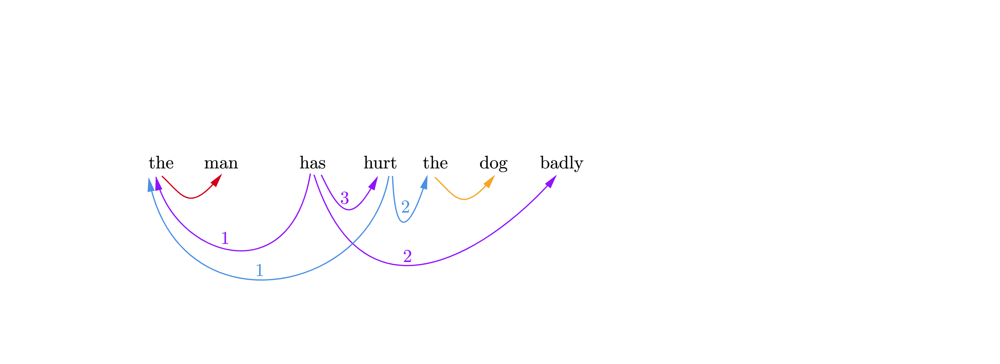
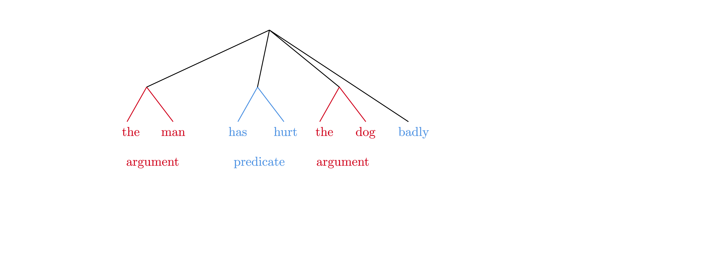
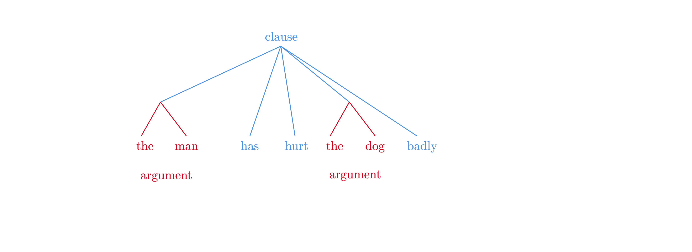
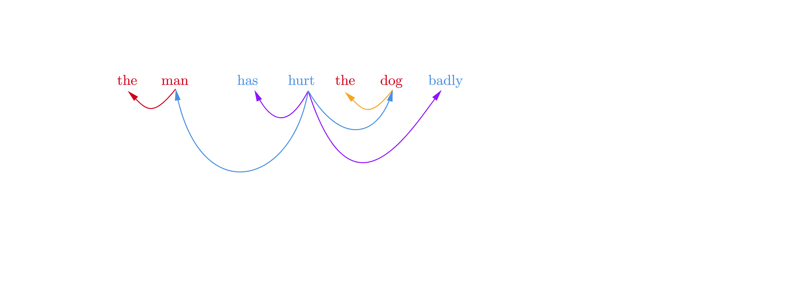
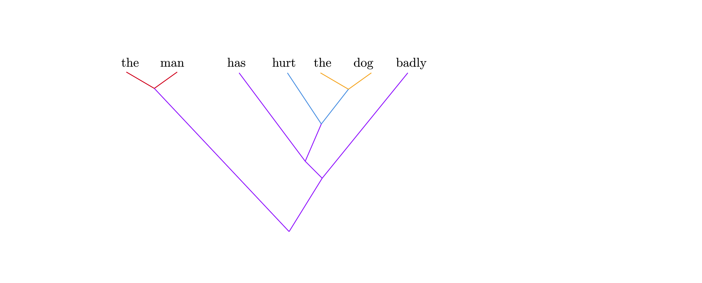
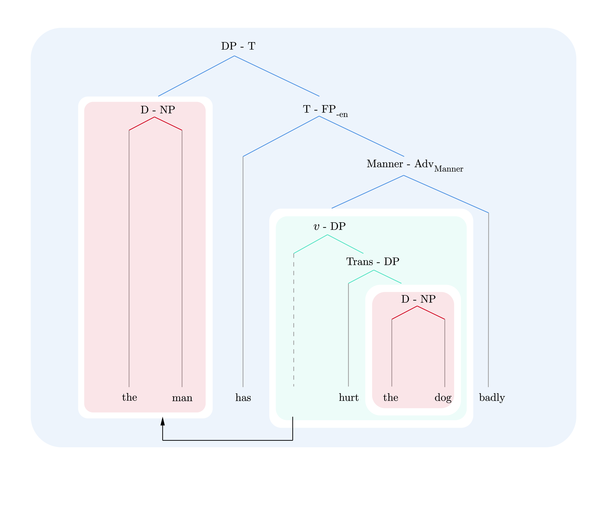
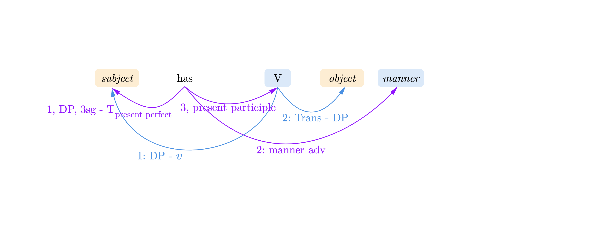

我下面要说的东西倒也不算很不科学，只是提供一种比较新（？）的视角吧。

# 中心语

中心语或者说“head”这个说法经常引起不必要的争论，因为不同的人定义什么是head的方法是完全不同的；生成语法学家会认为head是“最近一个被merge进句法树的、决定了句法树性质的特征”，于是我们有所谓的determiner phrase甚至case phrase的说法。如果你承认介词是介词短语的中心语，那么为什么格标记不是“格短语”的中心语呢？
更加functional-typological的作者会认为他们疯了，但是这个只不过是记号问题而已。

# “dependency grammar和constituency grammar完全不同”

如果你考虑过最简方案会导致怎么样的**表层**语法，就应该能够感觉到“dependency grammar和constituency grammar完全不同”这个说法完全是瞎扯。
比较老派、要大量使用treebank的NLP工作有时需要把成分树转化成依存树，这个做法在语言学理论中是有意义的。
有关的讨论见

- https://languagelog.ldc.upenn.edu/nll/?p=48725
- Boston, M. F., Hale, J. T., & Kuhlmann, M. 2009. Dependency structures derived from minimalist grammars. In The mathematics of language (pp. 1-12). Springer, Berlin, Heidelberg.
- Anikina, T., & Lasota, B. M. 2018. Dependency Structures derived from Minimalist Grammars. （这个是一个幻灯片，讲了很多很有趣的东西）
- Osborne, T., Putnam, M., & Groß, T. M. 2011. Bare phrase structure, label-less trees, and specifier-less syntax. Is Minimalism becoming a dependency grammar?.

虽然从学术谱系上生成语法都是constituency grammar（历史沿革上如此，入门教材也经常会让读者去做成分分析），但是考虑到最简方案是derivational syntax, 并且其中充斥着移位等破坏严格意义上的constituent的操作，以及selection等，可以想到某种在其中可以一眼看出短语结构的dependency grammar（或者某种在其中可以一眼看出依存关系的constituency grammar）是与它等价的关于表层形式的理论，而且这个dependency grammar由于移位的存在，实际上要求一个依存关系**网**，从其中抽取一部分能够得到一个依存关系树，并且这个树是well-nested的，可以直接转化成一个成分句法树。
GPSG一脉的理论反而和最简方案这一脉相远离了。
例如，What do you want to do?这种句子在做依存标注时，把第一个do标注成根节点是很好用的，而我们在生成语法中会看到这个do实际上是一堆特征的集体语音实现，其中就有一个interrogative Force head，因此这个依存标注和最简方案的分析是一致的。

一个我自己的妄想：主流生成语法的理论因为是从一些特征出发做derivation得到输出结果，是不适合用作纯语言描写的框架的，因为纯语言描写肯定是要从语料出发，建立关于**表层形式**的语法，而不是使用一组特征和vocabulary insertion rules这些没人见到过的、对心智表征的猜测。
那么有没有办法把主流生成语法变成一种关于表层形式的理论呢？我现在的想法是，可能主流生成语法对应的关于表层形式的理论是这样一种依存和成分都涉及的语法：
- 如果生成语法的derivational tree中的一个head和一个成分在同一个projection中，就认为它们之间存在依存关系（例如，在Distributed Morphology中，Trans head和宾语有依存关系，T head和主语有依存关系）；这两者的语音实现之间有同样的依存关系（例如，在英语中，Trans head和T head全都附着到了动词上面，因此动词和主语、宾语都有依存关系）。
  
  选取全部依存关系的一个（一般不包括cross-serial dependency的）子集，我们也可以得到成分关系的一个定义。但是这个成分关系和常见的成分句法标注经常是不同的；两者的关系见后面的讨论。
- 连接在同一个成分上的依存关系要排成一个序列，在越高的位置处产生的依存关系在这个序列中的位置也越高。例如，动词-主语这个依存关系来自T-SpecTP依存关系，而动词-宾语依存关系来自Trans-SpecTransP依存关系，所以前者排在后者前面。
  
  vP domain, TP domain, CP domain这些动词体现在依存关系的分组上面：在同一个domain中建立的依存关系分为一组，以下也称为domain。

  (phrasal) movement等价于一个成分的一部分依存关系线和其它成分的依存关系线发生交叉。

  以上序列可以把probe-goal机制、government and binding、movement、phase theory啥的东西全都变成全然关于表层形式的理论。  
- 应当注意上述的依存关系是成分到成分的，是不是要像正经的依存语法一样依存关系全都设置成词和词之间的可以自己看着办。如果我们给每个成分指定一个中心语，那么从成分到成分的依存关系就能够推导出词到词的依存关系，我们的语法就彻底变成（含有大量成分语法信息）的依存语法了。这个中心语的设置很大程度上是任意的（比如说介词有一定谓词性，但是也可以看成格的句法标记，那么你是把N还是把P当成中心语呢？好像CoreNLP真的就是把介词当成格标记的），有就行了（generative morphosyntax的树里面的head一般都是好几个head缩合在一起的，所以很难拿生成语法的理论去推什么是表层形式的中心语）。
 
  如前所述，由于哪些东西构成一个成分本身也是通过从derivational tree导出的依存关系定义的，word-to-constituent依存关系可以写成从word到constituent中的位置最高的依存关系的一条弧线，如果constituent中的依存关系能够自然地定义这个constituent的中心语——当然是可以的，因为这个依存关系本身也是一个word-constituent关系，把它的word设成前面说的那个constituent的中心语就可以了。
  但是，这样的中心语的定义和常见的依存标注中中心语的定义是不一致的。
  在已有的依存标注中更常见的做法是把中心语设置成一个domain中语义上最“核心”的词，比如说CP-TP-vP层中就设置成动词；当然这里还是存在介词算什么的这种问题。

- 我们来看一个例子。下面的句子
  > The man has hurt the dog badly

  的derivation tree造成的依存关系如下图所示：
  

  其中我们用红色和橙色来标记DP domain，用蓝紫色和蓝灰色来标记CP-TP-vP domain。其中，从*has*出发的关系按照其在derivational tree中的位置，从高到低是：
  1. *has*和*the man*的依存关系来自T head和SpecTP的关系
  2. *has*和*badly*的依存关系来自Adv-Manner head和SpecAdvMannerP之间的关系，这里采用cartography的说法，认为副词通过TP层中的functional head的specifier引入
  3. *has*和*hurt*的依存关系来自vP套在TP里面这个事实

  从*hurt*出发的关系为：
  1. *hurt*和*the man*的依存关系是v和Spec-vP的关系
  2. *hurt*和*the dog*的依存关系来自Trans head和SpecTransP的关系，这里采用Distributed Morphology的说法，认为及物动词宾语是通过TransP引入的
  
  上图实际上意味着一些老生常谈的理论争议实际上是不同的notation而已。它们以不同的方式展示这些依存关系。

  例如，考虑以下看起来很合理的转换规则，它将声称很多反对生成语法的语言学家主张的flat tree：
  1. 抹去依存关系中的序号，只保留domain group
  2. 按照domain group划分成分
  3. 抹去全部依存关系
   
  这会得到下图：
  

  我们看到把助动词和主动词划分在一个成分里是有道理的；这里*badly*和*has hurt*形成了一个不连续成分。
  另一方面，注意到*the man*和*the dog*的所有外部的依存关系都来自*has*, *hurt*和*badly*形成的那个domain，即两者存在严格的嵌套关系，我们可以认为这两个domain的嵌套关系应该在表层的句法树中得到反映，那么*has*, *hurt*和*badly*就应该在一个平面上，于是有
  

  再考虑如下导出依存语法的方法
  1. 抹去依存关系中的序号
  2. 在一个domain中指定一个中心语，将同一个domain中的依存关系弧线的方向统一改为指向这个中心语的
  3. 从外部连接到一个domain内部的依存关系全部改为连接到这个domain的中心语上面
  4. 抹去所有domain

  按照这个规则，刚才那句话中，蓝紫色线3号线的箭头方向要倒置，改成从*hurt*指向*has*，蓝紫色1，2号线和蓝灰色1，2号线如果连接在*has*上面，则接在*has*上的端子全部要挪到*hurt*上。
  类似的，红色和橙色线的箭头要倒置，蓝灰色2号线、蓝紫色1号线的末端要挪到名词上而不是determiner上，于是这就给出（为了区分依存关系的来源，虽然domain信息被抹去了，我们仍然保留线条的色彩）
  

  这和CoreNLP给出的依存树完全一致。
  
  再考虑如下转化规则：
  1. 选取一个子依存关系，确保每个词都能够被连接进去，但是不存在cross-serial dependency；cross-serial dependency在所有东西都完成后通过移位引入
  2. 自下而上构建成分关系：
     1. 在所有domain的依存关系中，较低domain的依存关系认定为较“低”，在同一个domain的依存关系中，较低的依存关系认定为较“低”；由最低的两个依存关系连接在一起的词构成一个成分；
     2. 如果一个由$l$级依存关系确定的成分$c$中的某个词$w_1$和另一个词$w_2$被一个$l+1$级依存关系连接，那么$c$和$w_2$也构成一个成分；如果$w_1$由更高的$l+2$级依存关系和$w_3$相连接，那么$c$和$w_2$构成的成分和$w_3$又构成一个成分，如此重复
     3. 抹去依存关系信息
  
  在上面的句子中，蓝灰色1号线会被丢弃；使用剩下的依存关系，显然*the man*和*the dog*是第一批被识别出来的成分；然后*hurt the dog*，*has hurt the dog*，*has hurt the dog badly*，*the man has hurt the dog badly*依次被识别出来。
  这就产生了如下的二分叉的ICA树（同样，虽然所有依存关系都被抹去了，我们还是在图上保留了色彩来标记各个成分关系来自哪个依存关系）：
  

  对VSO语言，非常可惜，虽然V-S依存关系和V-O依存关系有高低之分，但是没法用二叉树表示这个信息。

  有些书，比如说剑桥英语语法，会在每个non-terminal node上面加注这个node的功能（比如说“主语”）。这可以通过保留每个成分关系对应的依存关系来做到。比如说，将*the man*和*has hurt the dog badly*连接在一起的成分关系对应着蓝紫色1号线，即SpecTP-T的关系，因此我们可以在将*the man*和*has hurt the dog badly*连接在一起的成分关系上注明：“subject-predicate”。
  然后可以很容易地变更中心语的定义，因为此时不再需要挪动依存关系的头尾了。

  二叉树分析（第三个转换规则）可以揭示依存关系的高低排序，flat tree（第一个转换规则）可以揭示domain的嵌套关系，依存树（第二个转换规则）可以大致揭示domain的嵌套关系和一个domain中最重要的lexical word。
  有趣的是，依存树中的依存关系虽然头尾都被挪动过了，但是仍然可以做高低排序，从而二叉分支的信息可以体现在依存树中。
  这样一来，这种扩展的依存树（第二个转化规则）和第三个转换规则对应的二叉树分析就是等价的了。

  英语中SpecMannerP有语音实现（副词），Manner head本身却没有，在关于表层形式的理论中应该把Manner head放在哪里就成了一个问题。
  认为它附着在主动词和助动词上当然都是可以的，但这会给出不同的依存关系（例如，蓝紫色2号线是否应该接到主动词上面？）。
  这里唯一有意义的其实就是这件事：SpecManner-MannerAdv这个语法关系形成的位置低于subject-T，高于subject-v。
  考虑到我们希望开发一种在深层的理论变化时变动尽可能小的表层标注法，以依存语法为蓝本的下图：
  
  

  也可以转换成包含了一样的信息的下图

  

  这里我们将domain明确标注出来了。从它得到flat-tree、依存树是显然的：跟着domain的嵌套关系走就行了；从它得到二叉树分析也是显然的。
  实际上，从这种图得到通常意义上的依存语法反而是容易了，因为此时变更中心语无需挪动依存关系的头尾。这个图里面的movement是纯粹的描写工具：它用于强调从主动词到主语是存在依存关系的，但是从has到主语也存在。
  但这种图也有不是很直观的地方。比如说，只是看着它不容易理解为什么结构 [ [XP X YP ] ... ]会在历史中变成[X YP ... ] 
  这种结构变化的一个例子是“把”字结构。“NP1把NP2(给)V”这个结构最早可能可以分析为 [ NP1 [completion [把 NP2] V <del>NP2</del> ] ] ，我们把这个结构中涉及的c-command关系写出来：
  - “把” c-command NP2
  - NP2隐藏地和V存在Trans-DP的关系

  然后我们马上会发现，结构 [把P NP1 [把' 把 [UndergoP NP2 [ Undergo V <del>NP2</del> ] ] ] ]
  中也存在这些关系。因此，虽然在第一个结构中，“把”字和NP2结合得更加紧密，这两个结构实际上是非常接近的。通过依存标记容易看出这一点，通过成分标记就不容易了。
  这也解释了为什么会有人认为“把”是一个介词：由于“把”和NP2之间有紧密的c-command关系，两者看起来确实很像是构成了一个成分，那么这个成分看起来就会很像介词短语。
  为什么有紧密的c-command关系就可以认为是一个成分，虽然两者仅仅只是在一个span上可能需要解释一下。实际上我们前面说，一个domain中的一系列特征如果体现成一个词（它们显然大体上构成一个span，虽然中间也许有中断，如可以想象一种英语方言，其中会出现*I not dare do this*这样的句子，即*not*不足以阻断affix lowering，此时*dare*就是不连续的span——T, v, √dare——的共同语音实现；依照前面构建二叉成分树的标准，此时从*dare*到*do this*有一个低位的依存关系，于是有成分关系[dare do this]，从*dare*到*not*有中等位置的依存关系，从而相应的*not*可以认为是和[dare do this]复合，就有[not [dare do this]]，*I*和T有依存关系，从而也和*dare*有依存关系，那么它和[not [dare do this]]整体也有依存关系，于是就有[I [not [dare to this ] ] ]这样的分析，因此可以看到derivation过程中的不连续span spellout并不会阻碍表层结构的合理分析），那么我们在画表层形式的树的时候不应该把这个span显式地画出来，这实际上意味着我们已经在做把彼此只有c-command关系的“把”和NP2分析成一个成分这样的事情了，因为一个span中的两个head显然也只有c-command关系。
  当然，“把”和NP2的关系是head-to-constituent的关系，但是我们要指出的是，如果有某个形态学操作让“把”作为一个clitic附着在NP2上面，那么NP2移动时是可以带着“把”的——虽然纯句法层面，NP2移动和“把”无关，但chain-reduction时，“把”字附着的那个NP2副本没有语音实现，“把”又只能附着在一个NP上面，这会直接导致语音实现推导崩溃；一种可能是，“把”字附着的那个NP2副本语音实现以后，附着上“把”的那个语音实现被用于替换了更高位置的NP2副本。（由于chain reduction时可以认为各个副本某种意义上都是同一个，这没有违反任何局域性条件）
  这样一来，“把NP2”的行为就和一个真正的成分毫无区别了！这可以看成一种特殊版本的sideward movement，其能产性大概要弱一些，但是确实看上去很plausible。如果我们接受这种机制的存在，那么如果一个span上面有两个东西有紧密的c-command关系——通常都是一个head和一个constituent——实际上在表层形式中把它们分析成一个成分是没有问题的。
  
  不过，虽然在后一种结构中，“把”和NP2之间有紧密的c-command关系，但是它们毕竟没有形成一个成分；在一个结构中同时让“把”和NP2能够形成成分，同时NP2和V也能够形成成分，最自然的做法是需要sideward movement，这一点从关于表层形式的成分句法树[把P NP1 [把' 把 [UndergoP NP2 [ Undergo V <del>NP2</del> ] ] ] ]上也容易看出来，却不容易从依存标注上看出来。

  总之，由于允许存在成分句法树展示的关系以外的依存关系，表层形式中的加括号两难问题可以比较容易地解决。不允许sideward movement时，允许的两种括号中，能够发生移位（从而真的形成了一个成分）的应该最多只有一种。
  但这也不是绝对的。另一个常见的加括号两难是which student in the room这样的短语：
  > [Which [student in the room]] develops the software?
  > 
  > [Which student] develops the software in the room?

  不过，由于*in the room*可以容易地外移，*which student*的确可以形成一个成分。 

  加括号两难问题也在动补结构中存在。考虑*I gave my pen to him*这句话。其生成过程可能是：
  1. [my pen [to him]]
  2. [ConsequenceP √GIVE Consequence [my pen to him] ]
  3. [Trans my pen Trans [ConsequenceP √GIVE Consequence [<del>my pen</del> to him] ] ]
  4. [vP I v [Trans my pen Trans [ConsequenceP √GIVE Consequence [<del>my pen</del> to him] ] ] ]
  5. 然后就是TP层和CP层那些套路
  6. 语音实现：I gave my pen to him

  现在我们就有两种加括号方法：可以把表层形式分析为 I [gave [my pen to him] ]，因为*my pen*和*to him*由一个位置很低的依存关系联系在一起。
  但是也可以认为*to him*和*my pen*之间的依存关系来自如下生成过程：
  1. [TransP my pen √GIVE ]
  2. [TargetP to him [TransP my pen √GIVE ] ]
   
  这里，我们假定Target head附着在了*to him*上，那么to him和my pen由于c-command关系，有依存关系，并且这个依存关系的位置高于give和my pen之间的依存关系。
  此时，表层形式的句法分析应该是[I [[gave my pen] to him]]

  虽然我们看到了加括号两难的存在，但是也应该看到，两种分析的表层形式的主要差别仅仅体现在依存关系的高低上。
  事实上，我们甚至可以认为，由于Target head可以附着在√GIVE上，give to him形成了一个不连续成分。
  这几种分析都是有一定道理的；它们很可能共存于人群当中。

  实际上，这种依存关系头尾指向的词相同，但是权重不同的情况，经常是因为某个历时句法变化——具体来说是rebracketing——的体现。
  还有另一种更加“干净”的历时句法变化，其中依存关系的高低位置——从而表层形式的成分句法树是不变的。
  这里的术语非常混乱，有些人（如Haspelmath，见Whitman 2012中的引用）管后一种情况叫grammaticalization，把非grammaticalization，也就是涉及rebracketing的语法变化称为reanalysis。
  Whitman 2012认为rebracketing是非常少见的。例如，前述的“把”字句的最早形式——动补结构——的生成方式大体上是
  [vP NP1 v [ConsequenceP √把 Consequence [NP2 V] ] ] 

  于是表层形式中，√把、v和Consequence融合，形成[NP1 把 NP2 V]结构。之前我们认为NP2和“把”是一个比较低的依存关系连接起来的，然后两者再和V结合，但是按照此处的生成方式，即使是动补结构中，正确的表层结构分析也是[ NP1 把 [ NP2 V ] ]。
  因此，“把”的虚词化过程中也许并没有涉及任何rebracketing。

  前人将“把”分析成介词可能是受到汉语中无疑难的动词语法化成介词的例子的误导，可能是直觉上认为“把”和NP2似乎更加接近。
  关于前一点，我们应指出，不同环境中的同样元素出现不同的历时变化是可以理解的；关于后一点，应当指出，表层形式的分析同时牵扯到形态和句法操作，前者是高度局域的，并且经常不在乎句法树的全局结构；汉语有丰富的韵律结构，表层的两个词的“远近”和其在纯句法Merge阶段的关系可能是不同的。

- 形态是模糊不清的句法：一个domain中的若干个functional head融合在一起，被整体语音实现。将句法树的一部分当成形态，在最开始的、标记了依存关系的高低和domain的依存关系中将一部分词“缩合”，将这几个词涉及的依存关系的头尾合并在一起，然后把这部分词的可能取值用所有涉及这几个词的依存关系到可能的取值范围的映射——也就是word paradigm——给出。word paradigm可以是多级的：可以像拉丁语变位表一样，一步到位地把一个词的环境（也就是连接在其上的依存关系）到这个词的形式的映射用表格表示，也可以像现在的英语语法一样，这个、这个、这个地方用现在分词，然后最后的写成表格的paradigm就五个词形。

  实际上，从这个意义上说，前面介绍过的将一个domain中最lexical的词当成中心语的依存分析就相当于是将这个domain当作形态来处理了，因为这个domain的内部结构信息完全没有留下来：外界和这个domain的交流全部通过中心语，domain内部所有的东西都附着在中心语上面。
- 下面一个问题是这种框架下怎么样指定一个句子是合法的还是非法的，比如说成分句法有产生式语法，那么在我们的框架下对应于产生式语法的是什么呢？或者说，要怎么记录语法规则呢？我想，此时关于表层形式的语法在某种意义上会有点像构式语法：每个domain（或其子domain）的可能的spellout结果被记录，而且由于一个domain中的functional head不会出现在别的domain中，每个语法范畴都局限在它所属的构式中！（这几乎就是radical construction grammar了）
  例如，*has hurt ... badly*就对应如下的模板：
  
  与构式语法不同的地方就在于“构式”仅仅停留在产生式中：一个构式中的组件仍然可以参与下一步的操作。在中文语境中，我们还是称其为“构造”或是“结构”比较好。
  我们可以容易地从这个模板获得更常见的成分句法或是依存句法的规则。
  例如，如果抹去所有的依存关系，就得到如下产生式
  > S → Subject has V Object Manner

  这里看不出二叉树结构，因为二叉树的分支信息在依存关系中通过依存关系的高低来给出，这些信息却已经被抹去了。这一点我们已经讨论过了。

  我们也可以从这里看到形态和句法的相似性。

  另一个和构式语法不同的地方是移位操作仍然存在。移位有用的地方包括话题化和scrambling。

  除了带有依存关系的template以外，我们还需要指定词库——例如，及物动词只有与两个依存关系连接才合法：一个是$v$-DP关系，一个是Trans-DP关系。与更多的由轻动词导致的依存关系连接是非法的。
  这些约束对应derivational tree中哪些head被一起语音实现。然而前述的关于domain或是sub domain的template实际上就是给出了这个domain可能会被语音实现成什么样子。
  于是，容易看出，词典条目也是一种template。例如*hurt*的词典条目就对应vP domain的一个template：
  

  一致关系也可以编码在依存关系当中。一致关系无非是这样：同一个domain中的特征F导致特征F'需要取某个特殊的值，从而特征F和特征F'的语音实现之间存在一致关系。
  显然，这可以通过要求这个domain中来自F和F'的c-command关系的依存关系的两端具有一致关系来实现。
  这个依存关系可能是cross-serial的，正如Agree操作和Move其实很像一样。
- 这样推下来得到的关于表层形式的理论看着其实就是所谓的“类型学中的语法”，传统语法不像传统语法，但是又不是任何一种理论语言学语法模型。依存关系的高低体现某种“前后”关系，domain体现不同成分的远近，movement就是long range dependency，依存关系就是“grammatical relation”。
  每个domain（或其部分）对应参考语法的某一章，或者说某个construction。
  Dixon管这套东西叫basic linguistic theory，不过他把所有不遵从他的分析的人都指责为万恶的“formalist”。
  构式语法学家管这个叫做构式，但是这些构造是可以细分的。

  有关“domain或其部分”我们需要稍微仔细地讨论一下。通常的习惯是，如果若干个依存关系——或者说grammatical relation——被打包在成分句法树的某一层里面，比如说打包在TP层里面，或者TP层的某个子层，如MannerP层里面，那么就可以称为一个construction；显然，这意味着，若干个成分形成一个construction以后将会受到一定的语序约束，这个construction里面可以有多个占位符或者说slot（例如，只考虑verbal elements的TP层里面有argument slots）。主动句、被动句、反被动句这些是大体上对应TP层的construction，论元结构大体上是对应vP层的construction。还有一种把依存关系组织成更大的单元的方法可能要横跨多个层，却又没有把这些层涉及的全部语法关系都容纳进去，如direct-inverse system要横跨vP层和TP层，同时和表层论元（可能留在vP中也可能移动到TP中了）和动词上的direct-inverse标记有关，但是和TP层中的其它东西，如oblique arguments无关，此时通常称为system。形象地看，construction是macro-Merge，而system是macro-Agree。当然，对更大的construction而言，前述跨construction的system完全是这个更大的construction的一部分而已。
  
  construction和system当然不是确定无疑的概念。英语中的助动词用法可以说是tense-aspect-mood system，但是如果我们将TP层挖掉DP层看成一个统一的construction，那么也可以说这是tense-aspect-mood construction。
  
  我们也可以看到所谓的"describe a language in its own term"的口号和生成语法用统一的formalism描述不同语言是不矛盾的，正如凝聚态物理中简单的库仑相互作用在不同晶格上导致完全不同的地能有效理论一样。VSO的三叉树和SVO的二叉树可以说是describe a language in its own term的一个例子，但是它们完全可以看成句法Merge和少许形态学操作导致的不同有效理论。
  在描写句法相对简单，而形态很复杂的语言时，大部分注意力都会用在形态-音系上。的确，著名的波你尼语法（乔姆斯基在标准理论时期认为它是一部生成语法——它的确是，但是更像是一部derivational Minimalist morphosyntax，其中structure building机制构建句法树然后经历一系列local的重写操作而产生产出，而不是标准理论时期的短语结构语法加（句法）转换）的句法部分基本上就是把动词和tense特征、论元连接起来(Kiparsky 2007, Mishra 2019)。
  由于scrambling的广泛存在，二叉树分析不是很重要，依存关系无需排序，或者等价地说，成分句法树可以画得非常“平”。
  在描写句法相对复杂的语言时显然就不能够这么做。
  这也是describe a language in its own term，可是再一次，我们可以从生成语法的角度出发解释其必要性；这并不能说明生成语法就是错误的。
  
  这里描述的语法框架没有假设太多*具体的*语法范畴。抛开各种门派性的lip service不论，它很可能会被结构主义者接受。
  实际上，生成语法的起源动机之一就是将结构主义中的元语言（成分、依存等）严格化(Seuren 2015)。
  表面上，结构主义者反对心智主义而生成语言学支持心智主义，但是前者反对的心智主义是什么“德语因为在一些英语用宾格的地方用与格，所以德语静态英语动态”，而后者支持的心智主义是前者的研究成果的自然延伸：当你声称语言形式可以做任意的分析，但是最后基本的structural building mechanism都差不多，就很容易让人怀疑这些东西有心智上的真实性。（因此，现代的basic linguistic theory的语法作者声称理论语言学背离了乔姆斯基之前的语言学家的深邃思想——我只能说，恐怕这些人并不很能从历史中学到教训，同结构主义语言学家一样，他们的口号和实践是脱节的。）
- 这东西说不定还和NLP有关系(Hewitt and Manning 2019, Reif et al 2019, Manning et al 2020)。实际上，早就有人提出过类似的想法(Kahane and Mazziotta 2015)。这套东西的成分句法版本基本上就是含有domain结构的MCFG(Clark 2014)——后者中，agreement全靠模板操作，Agree操作可能引起的所有特征结构都需要显式指出，和我们这里“所有的agreement都需要在和它有关的依存关系中指出”是一样的，都不非常经济……

# 形态和句法的断然区隔

形态和句法当然是有区别的。但是我们应当注意，传统上归结为形态的*结构*的行为未必一定只和形态*操作*有关，它可能和句法*操作*有关，也即，存在syntax within the word；另一方面，毫无疑问是句法的*结构*的行为也可能和形态*操作*有关。

我们应该会同意，英语中动词第三人称单数这些东西是有关形态学的，而疑问句动词提前是句法学的内容。
然后一般的类型学的书就会说“前者通过语素来体现第三人称单数这个特征，后者通过语序来体现疑问这个特征”。

这个说法当然是没有什么问题的，但是这样的分类给人一种“散乱”的感觉：我们可以对看得见摸得着的语素说上一些什么，比如说我们可以列举词汇变形的word paradigm；如果两个语素同时出现，那就是说它们对应的特征也同时出现。
但是我们怎样去理解语序变化和一个抽象的特征之间的关系呢？
好像除了列举具有不同的特征的句子的句式以外，没有什么可以做的。

对每一种特征组合，我们都要把它对应的句式列出来。
一般现在时陈述句是He does sth, 一般现在时疑问句是Does he do sth；现在完成时陈述句是He has done sth, 现在完成时疑问句是Has he done sth。
是不是可以把has理解成某种意义上的主动词，认为它选择了过去分词，来变相地实现完成体呢？
大概是不行的，TODO
总之，记录通过语序表达的特征时，**组合性**是严重缺乏的：特征A的行为和特征B的行为都被记录了以后，特征AB的行为还需要单独的记录。

对描写语言学，这样是够了，而且也是有必要的、最稳妥的，因为它忠实地反映了语言事实。
然后我就夹带一点私货，吹捧一下Distributed Morphology。这个框架是音系学（是的你没听错）大师Morris Halle和句法学家、神经语言学家Alec Marantz弄出来的。

比如说我们考虑下面这句话: Have you been in that place? 在Distributed Morphology的框架下，这句话可以认为是对应如下的句法树（其中我们省略了和这里的讨论无关的边缘层级）。

[ForceP [interrogative] ... [TP you [AspP [perfect] √BE in that place ] ] ]

这个句法树反映的不是直接对**表层**的句子做切分得到的树，而是一句话的**特征结构**。它一方面不同于表层的句法和形态现象，一方面和语义之间也未必有完全严格的映射（例如，语法性别和一个东西实际的性别、比喻意义上的性别未必一样）。
这可能会造成一种不好的倾向，就是把所有语义、语用信息都一股脑编码进来；例如，对scrambling的研究中，经常出现通过引入一大堆functional head强行搞curve fitting的做法(Struckmeier 2017, Haider 2020)

现在我们给上面的句法树中涉及的特征指派如下形态学行为：

- [interrogative]会吸引和它最近的动词性成分（常见，）
- [perfect]在经历vocabulary insertion以后变成has 

因此我们可以看到，英语疑问句中的动词前置的产生和通过动词词缀来体现疑问实际上是类似的策略：两者都是通过局域形态操作来完成的。

我们可以总结出几点：
- 导致形态现象和很多句法现象（如语序变化来标记某个特征）的机制是类似的1
- 词并不比句法结构更“真实”，因为两者都是抽象特征具体化产生的

因此，句法学和很大一部分形态学是统一的连续体。morphosyntax这个提法就暗示了这一点。

# 参考文献

Clark, A. (2014). An introduction to multiple context free grammars for linguists.

Haider, Hubert. "A null theory of scrambling" Zeitschrift für Sprachwissenschaft, vol. 39, no. 3, 2020, pp. 375-405. https://doi.org/10.1515/zfs-2020-2019

Hewitt, J., & Manning, C. D. (2019). A structural probe for finding syntax in word representations. In Proceedings of the 2019 Conference of the North American Chapter of the Association for Computational Linguistics: Human Language Technologies, Volume 1 (Long and Short Papers) (pp. 4129-4138).

Kahane, S., & Mazziotta, N. (2015, July). Syntactic polygraphs. a formalism extending both constituency and dependency. In Mathematics of Language.

Kiparsky, P. 2007. On the architecture of Pāṇini’s grammar. In Sanskrit computational linguistics (pp. 33-94). Springer, Berlin, Heidelberg.

Manning, C. D., Clark, K., Hewitt, J., Khandelwal, U., & Levy, O. (2020). Emergent linguistic structure in artificial neural networks trained by self-supervision. Proceedings of the National Academy of Sciences, 117(48), 30046-30054.

Mishra, A. 2019. Modeling the Pāṇinian System of Sanskrit Grammar (p. 168). Heidelberg University Publishing (heiUP).

Reif E, Yuan A, Wattenberg M, et al. Visualizing and measuring the geometry of BERT[J]. Advances in Neural Information Processing Systems, 2019, 32.

Seuren, P. A. 2015. Prestructuralist and structuralist approaches to syntax. In Syntax--theory and analysis: An international handbook (pp. 134-157). Mouton de Gruyter.

Struckmeier, Volker. 2017. Against information structure heads: a relational
analysis of German scrambling. Glossa: a journal of general linguistics
2(1): 1. 1–29, DOI: https://doi.org/10.5334/gjgl.56

Whitman, J. 2012. Misparsing and syntactic reanalysis. van Kemenade and de Haas (eds.), 69-87.
