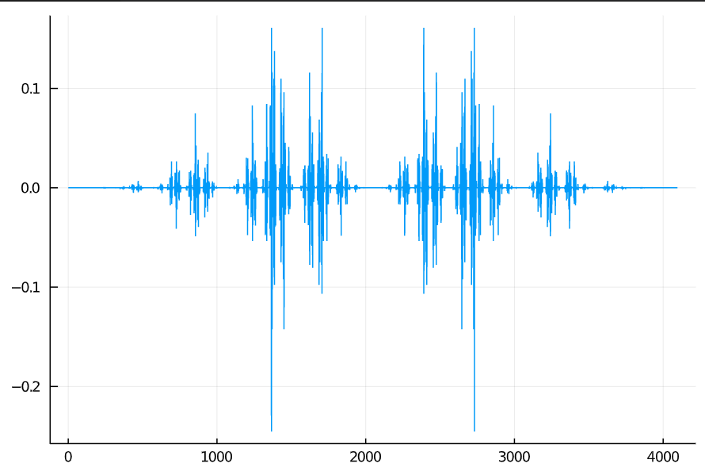
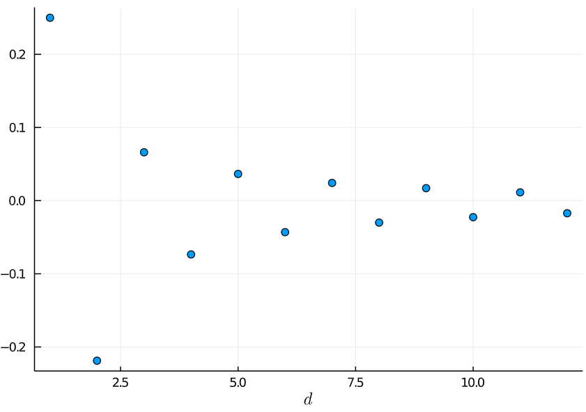
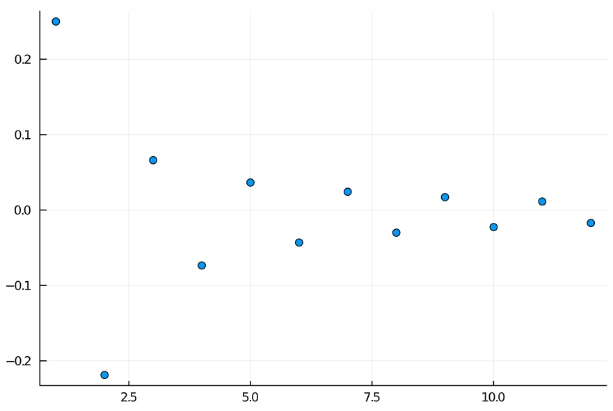

Investigation of 1D AFM Heisenberg chain
------

# Exact diagonalization

The code can be found in `ed.jl`. 

The ground state wavefunction is shown here:

The correlation function is shown here:

It is a pity that due to memory limits, we only performed an ED with 12 sites.

# DMRG - renormalization group version

We created several DMRG programs:
- `real-space-energy.jl`, DMRG as a kind of real space RG, which only keeps track of the energy
- `real-space-energy-wavefunction.jl`, also DMRG as a kind of real space RG, but keeping track of 
  the projectors used in truncation, therefore enabling calculation of the ground state wavefunction
- `itensor-dmrg-benchmark.jl`, DMRG as a tensor network method, which runs on a lattice with 12 sites
- `itensor-dmrg.jl`, scaled-up version of DMRG as a tensor network method

In this section we discuss the RG version of DMRG.

# DMRG - tensor network version

